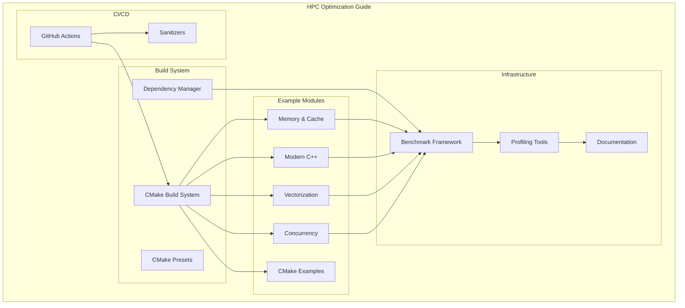
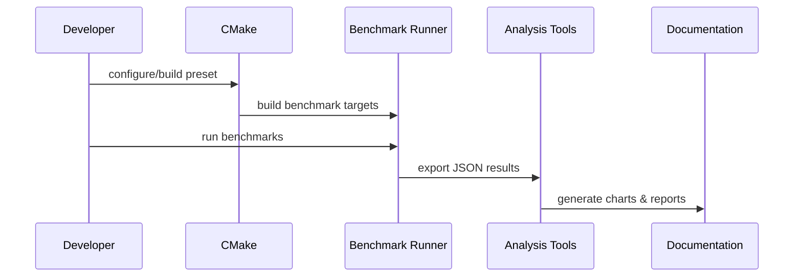

# Design Document: HPC Optimization Guide

## Overview

本项目是一个模块化的高性能计算优化案例库，采用现代 CMake 构建系统，提供可独立运行的优化示例、基准测试和详细文档。项目结构遵循"教学优先"原则，每个模块都是自包含的学习单元。

## Design Goals and Non-Goals

### Goals

- 通过可运行示例与基准测试展示性能优化的可度量收益。
- 为学习者提供渐进式路径与可复现的实验流程。
- 通过统一结构与模板降低新增模块成本。
- 保持跨平台可移植性与代码可维护性。

### Non-Goals

- 不构建生产级 HPC 框架或完整性能分析平台。
- 不包含 GPU、分布式计算或硬件专用优化的完整体系。
- 不追求覆盖所有编译器与平台的极限兼容。

## Scope and Constraints

- 目标语言标准为 C++20，构建工具为 CMake 3.20+。
- 基准测试依赖 Google Benchmark，单元测试依赖 Google Test，属性测试依赖 RapidCheck。
- 默认以 Linux 为主要验证平台，macOS/Windows 为尽力支持。
- 性能分析工具（perf、FlameGraph、VTune）允许缺失并提供降级路径。
- SIMD 示例需要根据 CPU 能力进行编译期或运行期的指令集选择。

## Architecture

### 高层架构图



### 项目目录结构

```
hpc-optimization-guide/
├── CMakeLists.txt                 # 根 CMake 配置
├── CMakePresets.json              # 构建预设
├── README.md                      # 项目主文档
├── LICENSE
│
├── cmake/                         # CMake 模块和工具
│   ├── CompilerOptions.cmake      # 编译器选项管理
│   ├── Dependencies.cmake         # 依赖管理 (FetchContent)
│   ├── Sanitizers.cmake           # Sanitizer 配置
│   └── ExampleTemplate.cmake      # 示例模块模板
│
├── examples/                      # 优化示例模块
│   ├── 01-cmake-modern/           # 现代 CMake 示例
│   ├── 02-memory-cache/           # 内存与缓存优化
│   ├── 03-modern-cpp/             # 现代 C++ 特性
│   ├── 04-simd-vectorization/     # SIMD 向量化
│   └── 05-concurrency/            # 并发与多线程
│
├── benchmarks/                    # 基准测试
│   ├── CMakeLists.txt
│   └── common/                    # 通用基准测试工具
│
├── tools/                         # 辅助工具
│   ├── flamegraph/                # FlameGraph 生成脚本
│   └── analysis/                  # 性能分析脚本
│
├── docs/                          # 文档
│   ├── learning-path.md           # 学习路径
│   ├── profiling-guide.md         # 性能分析指南
│   └── images/                    # 文档图片
│
└── .github/
    └── workflows/                 # CI/CD 配置
        ├── build.yml
        └── benchmark.yml
```

## Key Workflows

### 构建与测试流程

1. 使用 CMake Preset 选择构建类型与 sanitizer。
2. CMake 生成目标并拉取依赖。
3. 构建示例与测试，运行单元/属性测试。
4. 输出构建与测试报告，失败则阻断后续步骤。

### 基准测试与分析流程



### 文档生成流程

- 文档来源：模块 README、示例代码注释、基准测试 JSON 与分析报告。
- 通过 CI 校验文档与示例同步（例如 README 与目录一致性检查）。
- 学习路径与模块索引由 docs/learning-path.md 维护。

## Components and Interfaces

### 1. 构建系统组件 (Build System)

#### CMake 模块接口

```cmake
# cmake/CompilerOptions.cmake
# 提供统一的编译器选项管理

function(hpc_set_compiler_options target)
    # 设置警告级别
    # 设置优化级别
    # 设置架构特定选项
endfunction()

function(hpc_enable_sanitizers target)
    # 启用 AddressSanitizer
    # 启用 ThreadSanitizer
    # 启用 UndefinedBehaviorSanitizer
endfunction()
```

```cmake
# cmake/Dependencies.cmake
# 依赖管理

function(hpc_fetch_google_benchmark)
    # 使用 FetchContent 下载 Google Benchmark
endfunction()

function(hpc_fetch_google_test)
    # 使用 FetchContent 下载 Google Test
endfunction()
```

```cmake
# cmake/ExampleTemplate.cmake
# 示例模块标准化模板

function(hpc_add_example)
    # 参数: NAME, SOURCES, BENCHMARK_SOURCES
    # 创建可执行文件
    # 链接依赖
    # 注册基准测试
endfunction()
```

### 2. 示例模块组件 (Example Modules)

每个示例模块遵循统一结构：

```
examples/02-memory-cache/
├── CMakeLists.txt
├── README.md                      # 模块文档
├── src/
│   ├── aos_vs_soa.cpp            # AOS vs SOA 示例
│   ├── false_sharing.cpp          # 伪共享示例
│   ├── alignment.cpp              # 内存对齐示例
│   └── prefetch.cpp               # 预取示例
├── include/
│   └── memory_utils.hpp           # 可复用工具
└── bench/
    └── memory_bench.cpp           # 基准测试
```

#### 示例模块接口

```cpp
// 每个示例模块提供的标准接口
namespace hpc::memory {

// AOS vs SOA 示例
struct ParticleAOS {
    float x, y, z;
    float vx, vy, vz;
};

struct ParticleSOA {
    std::vector<float> x, y, z;
    std::vector<float> vx, vy, vz;
};

void update_particles_aos(std::vector<ParticleAOS>& particles);
void update_particles_soa(ParticleSOA& particles);

// 伪共享示例
struct alignas(64) CacheLineAligned {
    std::atomic<int> counter;
};

void demonstrate_false_sharing();
void demonstrate_aligned_counters();

} // namespace hpc::memory
```

### 3. 基准测试框架组件 (Benchmark Framework)

```cpp
// benchmarks/common/benchmark_utils.hpp
namespace hpc::bench {

// 防止编译器优化的工具
template<typename T>
void DoNotOptimize(T&& value);

void ClobberMemory();

// 参数化基准测试辅助
struct BenchmarkConfig {
    std::vector<int64_t> sizes;
    int64_t iterations;
    bool enable_counters;
};

// 结果输出
void export_results_json(const std::string& filename);
void generate_comparison_chart(const std::string& baseline, 
                                const std::string& optimized);

} // namespace hpc::bench
```

### 4. 性能分析工具组件 (Profiling Tools)

```bash
# tools/flamegraph/generate_flamegraph.sh
# 输入: 可执行文件路径
# 输出: SVG 火焰图

#!/bin/bash
perf record -g "$1"
perf script | stackcollapse-perf.pl | flamegraph.pl > "$2"
```

```python
# tools/analysis/benchmark_compare.py
# 比较两次基准测试结果

def compare_benchmarks(baseline_json: str, current_json: str) -> Report:
    """比较基准测试结果，生成性能变化报告"""
    pass
```

## Data Models

### 基准测试结果模型

```cpp
// 基准测试结果数据结构
struct BenchmarkResult {
    std::string name;
    std::string module;
    int64_t iterations;
    double real_time_ns;
    double cpu_time_ns;
    std::map<std::string, double> counters;  // 自定义计数器
    std::string timestamp;
};

struct BenchmarkSuite {
    std::string version;
    std::string compiler;
    std::string cpu_info;
    std::vector<BenchmarkResult> results;
};
```

### 示例模块元数据模型

```cpp
// 示例模块描述
struct ExampleMetadata {
    std::string id;              // e.g., "02-memory-cache/aos-vs-soa"
    std::string title;
    std::string description;
    DifficultyLevel difficulty;  // Beginner, Intermediate, Advanced
    std::vector<std::string> tags;
    std::vector<std::string> prerequisites;
    std::vector<std::string> related_examples;
};

enum class DifficultyLevel {
    Beginner,
    Intermediate,
    Advanced
};
```

### CMake 预设模型

```json
{
  "version": 6,
  "configurePresets": [
    {
      "name": "base",
      "hidden": true,
      "generator": "Ninja",
      "binaryDir": "${sourceDir}/build/${presetName}"
    },
    {
      "name": "release",
      "inherits": "base",
      "cacheVariables": {
        "CMAKE_BUILD_TYPE": "Release",
        "CMAKE_CXX_FLAGS": "-O3 -march=native"
      }
    },
    {
      "name": "debug",
      "inherits": "base",
      "cacheVariables": {
        "CMAKE_BUILD_TYPE": "Debug"
      }
    },
    {
      "name": "asan",
      "inherits": "base",
      "cacheVariables": {
        "CMAKE_BUILD_TYPE": "Debug",
        "ENABLE_ASAN": "ON"
      }
    },
    {
      "name": "tsan",
      "inherits": "base",
      "cacheVariables": {
        "CMAKE_BUILD_TYPE": "Debug",
        "ENABLE_TSAN": "ON"
      }
    }
  ]
}
```

## Extension Points and Conventions

- **新增模块**: 在 examples/ 下创建按序号命名的目录，复用 hpc_add_example() 注册。
- **命名规范**: 示例源文件采用 snake_case；基准测试以 *_bench.cpp 命名。
- **模块文档**: 每个模块包含 README.md，说明目标、前置知识、运行方式与性能结论。
- **复用工具**: 通用工具放在 benchmarks/common 或模块 include/ 中。

## Documentation Strategy

- 主 README 提供快速开始与模块索引。
- docs/learning-path.md 作为推荐学习路线的唯一来源。
- docs/profiling-guide.md 覆盖常用性能分析工具的最小集合。
- 模块 README 包含：背景、优化原理、运行命令、关键结果与常见误区。

## Correctness Properties

*A property is a characteristic or behavior that should hold true across all valid executions of a system—essentially, a formal statement about what the system should do. Properties serve as the bridge between human-readable specifications and machine-verifiable correctness guarantees.*

### Property 1: CMake Target-Based Commands Only

*For any* CMakeLists.txt file in the project, there SHALL be no usage of directory-based commands (include_directories, link_libraries, link_directories), only target-based variants (target_include_directories, target_link_libraries, target_link_directories).

**Validates: Requirements 1.1**

### Property 2: Example Module Template Consistency

*For any* example module created using hpc_add_example(), the resulting target SHALL have correct include paths, link dependencies, and be registered with the benchmark system.

**Validates: Requirements 1.6**

### Property 3: SOA Performance Advantage for Sequential Access

*For any* particle system with N > 1000 particles, updating all particles using SOA layout SHALL complete in less time than updating using AOS layout when accessing data sequentially.

**Validates: Requirements 2.1**

### Property 4: Cache-Line Aligned Counters Eliminate False Sharing

*For any* multi-threaded counter increment scenario with T threads, using alignas(64) aligned counters SHALL achieve at least 2x better throughput than unaligned counters when T > 1.

**Validates: Requirements 2.2, 5.3**

### Property 5: Aligned Memory SIMD Performance

*For any* array of floats with size N > 256, SIMD operations on 64-byte aligned memory SHALL complete in less time than on unaligned memory.

**Validates: Requirements 2.3**

### Property 6: Move Semantics Performance Advantage

*For any* object containing dynamically allocated memory of size > 1KB, move construction SHALL be at least 10x faster than copy construction.

**Validates: Requirements 3.2**

### Property 7: Vector Reserve Reduces Allocations

*For any* sequence of N push_back operations on std::vector, a pre-reserved vector (reserve(N)) SHALL perform zero reallocations, while an unreserved vector SHALL perform O(log N) reallocations.

**Validates: Requirements 3.3**

### Property 8: SIMD Wrapper Correctness

*For any* input array of floats, the SIMD-wrapped implementation SHALL produce results equivalent (within floating-point tolerance) to the scalar reference implementation.

**Validates: Requirements 4.2, 4.3**

### Property 9: Vectorized vs Scalar Speedup

*For any* vectorizable operation on arrays of size N > 1024, the vectorized implementation SHALL achieve at least 2x speedup over the scalar implementation on supported hardware.

**Validates: Requirements 4.1, 4.5**

### Property 10: Atomic Operations Correctness

*For any* concurrent increment scenario with T threads each performing N increments, the final counter value SHALL equal T * N when using std::atomic with appropriate memory ordering.

**Validates: Requirements 5.1**

### Property 11: Lock-Free Queue Invariants

*For any* sequence of concurrent push and pop operations on a lock-free queue, the queue SHALL maintain FIFO ordering and never lose or duplicate elements.

**Validates: Requirements 5.2**

### Property 12: OpenMP Scaling Efficiency

*For any* parallelizable workload with sufficient work per thread, using OpenMP with T threads SHALL achieve at least 0.5 * T speedup (50% efficiency) compared to single-threaded execution.

**Validates: Requirements 5.4, 5.5**

### Property 13: Benchmark JSON Output Validity

*For any* completed benchmark run, the JSON output SHALL be valid JSON and contain required fields: name, iterations, real_time, cpu_time.

**Validates: Requirements 6.4**

## Error Handling

### 构建系统错误处理

| 错误场景 | 处理策略 |
|---------|---------|
| 依赖下载失败 | FetchContent 提供清晰错误信息，建议检查网络或使用镜像 |
| 不支持的编译器 | CMake 配置阶段检测并报错，列出支持的编译器版本 |
| CPU 不支持 SIMD 指令集 | 自动降级到支持的指令集，或禁用相关示例 |
| Sanitizer 不可用 | 跳过 sanitizer 构建，输出警告信息 |

### 运行时错误处理

```cpp
// 示例：SIMD 能力检测
namespace hpc::simd {

enum class SIMDLevel {
    None,
    SSE2,
    SSE4,
    AVX,
    AVX2,
    AVX512
};

SIMDLevel detect_simd_level();

// 运行时分发
template<typename Func>
auto dispatch_simd(Func&& scalar, Func&& sse, Func&& avx, Func&& avx512) {
    switch (detect_simd_level()) {
        case SIMDLevel::AVX512: return avx512;
        case SIMDLevel::AVX2:
        case SIMDLevel::AVX:    return avx;
        case SIMDLevel::SSE4:
        case SIMDLevel::SSE2:   return sse;
        default:                return scalar;
    }
}

} // namespace hpc::simd
```

### 基准测试错误处理

```cpp
// 基准测试验证
namespace hpc::bench {

// 确保基准测试结果有效
void validate_benchmark_result(const BenchmarkResult& result) {
    if (result.real_time_ns <= 0) {
        throw std::runtime_error("Invalid benchmark: non-positive time");
    }
    if (result.iterations <= 0) {
        throw std::runtime_error("Invalid benchmark: non-positive iterations");
    }
}

// 检测异常值
bool is_outlier(double value, const std::vector<double>& samples) {
    // 使用 IQR 方法检测异常值
    // ...
}

} // namespace hpc::bench
```

## Operational Considerations

- **可复现性**: 基准测试输出包含编译器版本、CPU 信息、构建类型与提交版本。
- **性能波动**: 默认提供 warm-up 轮次与多次重复，输出均值与标准差。
- **资源隔离**: 建议在低负载环境运行基准测试，必要时固定 CPU 亲和性。

## Risks and Mitigations

| 风险 | 影响 | 缓解策略 |
|------|------|----------|
| 不同硬件导致结果差异 | 结果不可比 | 记录环境信息并提供基线对比工具 |
| 编译器优化差异 | 示例结论偏差 | 明确推荐编译器与版本区间 |
| 基准测试不稳定 | 误判优化收益 | 重复测量与异常值检测 |
| 性能工具缺失 | 文档体验降低 | 提供降级流程与替代说明 |

## Testing Strategy

### 测试框架选择

- **单元测试**: Google Test (gtest)
- **属性测试**: RapidCheck (C++ property-based testing library)
- **基准测试**: Google Benchmark
- **覆盖率**: gcov/lcov

### 双重测试方法

本项目采用单元测试和属性测试相结合的方法：

1. **单元测试**: 验证特定示例和边界情况
   - 每个示例模块的基本功能
   - 错误处理路径
   - 边界条件

2. **属性测试**: 验证跨所有输入的通用属性
   - 性能不变量（优化版本更快）
   - 正确性不变量（结果等价）
   - 并发安全性

### 属性测试配置

```cpp
// 使用 RapidCheck 进行属性测试
#include <rapidcheck.h>

// 每个属性测试至少运行 100 次迭代
RC_GTEST_PROP(SIMDTests, WrapperCorrectness, (std::vector<float> input)) {
    // Feature: hpc-optimization-guide, Property 8: SIMD Wrapper Correctness
    // Validates: Requirements 4.2, 4.3
    
    RC_PRE(input.size() >= 4);  // SIMD 需要最小向量大小
    
    auto scalar_result = scalar_implementation(input);
    auto simd_result = simd_implementation(input);
    
    RC_ASSERT(results_equal_within_tolerance(scalar_result, simd_result, 1e-6f));
}

RC_GTEST_PROP(ConcurrencyTests, AtomicCounterCorrectness, 
              (int num_threads, int increments_per_thread)) {
    // Feature: hpc-optimization-guide, Property 10: Atomic Operations Correctness
    // Validates: Requirements 5.1
    
    RC_PRE(num_threads > 0 && num_threads <= 16);
    RC_PRE(increments_per_thread > 0 && increments_per_thread <= 10000);
    
    std::atomic<int> counter{0};
    // ... 并发增量测试
    
    RC_ASSERT(counter.load() == num_threads * increments_per_thread);
}
```

### 测试目录结构

```
tests/
├── unit/                          # 单元测试
│   ├── memory/
│   │   ├── aos_soa_test.cpp
│   │   └── alignment_test.cpp
│   ├── simd/
│   │   └── wrapper_test.cpp
│   └── concurrency/
│       └── atomic_test.cpp
│
├── property/                      # 属性测试
│   ├── memory_properties.cpp
│   ├── simd_properties.cpp
│   └── concurrency_properties.cpp
│
└── integration/                   # 集成测试
    └── build_system_test.py
```

### CI 测试矩阵

```yaml
# .github/workflows/test.yml
strategy:
  matrix:
    os: [ubuntu-latest, macos-latest]
    compiler: [gcc-12, gcc-13, clang-15, clang-16]
    build_type: [Debug, Release]
    sanitizer: [none, asan, tsan, ubsan]
    exclude:
      - sanitizer: tsan
        build_type: Release  # TSan 需要 Debug 构建
```

### 性能回归测试

```python
# tools/analysis/regression_check.py
def check_performance_regression(baseline: dict, current: dict, 
                                  threshold: float = 0.1) -> bool:
    """
    检查性能回归
    threshold: 允许的最大性能下降比例 (10%)
    """
    for bench_name, baseline_time in baseline.items():
        current_time = current.get(bench_name)
        if current_time is None:
            continue
        
        regression = (current_time - baseline_time) / baseline_time
        if regression > threshold:
            print(f"Performance regression in {bench_name}: {regression:.1%}")
            return False
    
    return True
```

