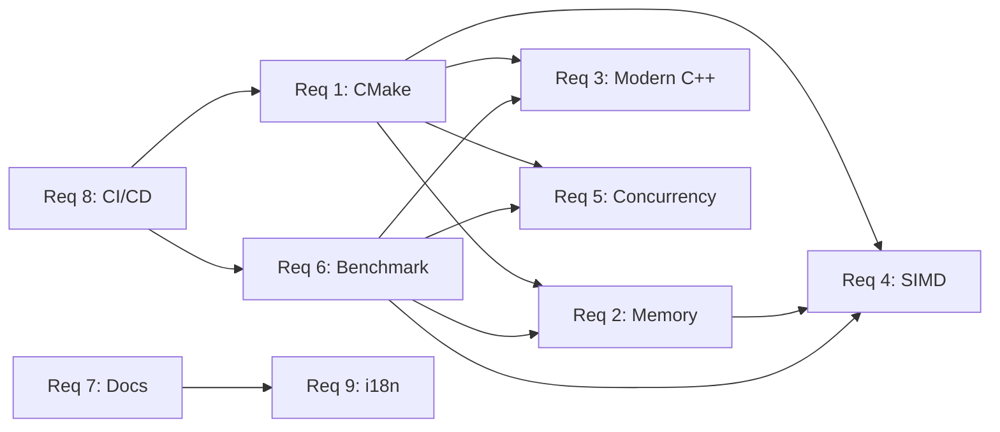

# Requirements Document

## Introduction

本项目是一个高性能计算（HPC）优化案例汇总与指导的 GitHub 开源项目。项目旨在通过实际代码示例、基准测试和详细文档，帮助开发者掌握现代 C++、现代 CMake 和性能优化的最佳实践。每个优化主题都包含可运行的代码示例、性能对比基准测试和详细的技术解释。

## Glossary

### 系统角色

- **HPC_Guide**: 高性能计算优化指南项目的主系统
- **Benchmark_Runner**: 基于 Google Benchmark 的性能测试执行器
- **Example_Module**: 单个优化案例模块，包含源码、测试和文档
- **Build_System**: 基于现代 CMake 的构建系统
- **Documentation**: 项目文档体系，包括模块 README、学习路径和性能分析指南（手动维护，CI 校验同步）

### 核心技术术语

- **AOS (Array of Structures)**: 结构体数组，每个元素是一个完整结构体
- **SOA (Structure of Arrays)**: 数组结构体，每个字段是一个独立数组，缓存友好
- **SIMD (Single Instruction, Multiple Data)**: 单指令多数据，利用向量寄存器并行处理
- **False Sharing (伪共享)**: 多线程写入同一缓存行的不同变量导致的性能退化
- **Cache Line (缓存行)**: CPU 缓存的最小传输单元，通常为 64 字节
- **Lock-Free (无锁)**: 不使用互斥锁的并发数据结构，通过原子操作实现
- **Memory Ordering (内存序)**: C++ 原子操作的内存可见性保证级别（relaxed / acquire-release / seq_cst）
- **Intrinsics**: 编译器内建函数，直接映射到 CPU 指令（如 `_mm256_add_ps`）
- **FetchContent**: CMake 内置模块，用于在配置阶段自动下载和集成外部依赖
- **Sanitizer**: 编译器插桩工具，用于检测内存错误（ASan）、数据竞争（TSan）、未定义行为（UBSan）

## Goals and Non-Goals

### Goals

- 提供可独立运行的优化示例与基准测试，覆盖内存、并发、向量化、现代 C++、现代 CMake 等主题。
- 确保性能对比具备可复现性，记录环境与编译配置，便于结果追溯。
- 建立清晰的学习路径与模块化文档，使读者能逐步提升。
- 通过 CI 与测试体系维护代码质量，降低回归风险。

### Non-Goals

- 不构建可直接用于生产的 HPC 框架或库。
- 不涵盖 GPU/CUDA、分布式集群调度等超出范围的内容。
- 不提供特定厂商专有工具的深度集成示例。

## Stakeholders and Personas

- **学习者**: 需要从基础到进阶的性能优化路径与示例。
- **性能工程师**: 需要快速验证优化策略与工具链。
- **贡献者**: 需要清晰的结构、规范与 CI 反馈以便协作。
- **维护者**: 需要可持续的文档与测试体系。

## Scope and Assumptions

- 项目以 Linux 作为主要验证平台，macOS/Windows 为尽力支持。
- 依赖支持 C++20 的编译器（GCC 11+、Clang 14+，MSVC 为尽力支持）。
- 运行基准测试默认需要本机具备 perf 等常用分析工具；缺失时允许降级。
- SIMD 示例默认假设 CPU 至少支持 SSE2，高级指令集为可选功能。
- 构建阶段默认具备网络访问以拉取依赖，但提供缓存或离线方案建议。

## Quality Attributes (Cross-cutting)

- **可复现性**: 基准测试输出必须包含编译器版本、CPU 信息、构建类型与提交版本。
- **可移植性**: 示例代码遵循标准 C++20，平台特定优化需有宏保护与回退实现。
- **可维护性**: 示例模块结构统一，新增模块无需修改核心构建逻辑。
- **可观测性**: 性能数据具备结构化输出（JSON），并可生成可视化对比。
- **安全与合规**: 仅使用开源依赖，避免在运行时发起外部网络请求。

## Requirements

### Requirement 1: 现代 CMake 构建系统 【Must】

**User Story:** As a developer, I want a well-structured modern CMake build system, so that I can easily build, test, and benchmark all examples with best practices.

#### Acceptance Criteria

1. THE Build_System SHALL use target-based CMake commands (target_include_directories, target_link_libraries) instead of directory-based commands
2. WHEN a user clones the repository, THE Build_System SHALL automatically download dependencies (Google Benchmark, Google Test) using FetchContent or CPM.cmake
3. THE Build_System SHALL provide CMakePresets.json with configurations for Debug, Release, RelWithDebInfo, and Sanitizer builds
4. WHEN building in Release mode, THE Build_System SHALL enable optimization flags (-O3, -march=native, -ffast-math where appropriate)
5. THE Build_System SHALL demonstrate anti-patterns vs best practices through documented examples in a dedicated cmake-examples directory
6. WHEN a new example module is added, THE Build_System SHALL allow easy integration through a standardized CMakeLists.txt template

### Requirement 2: 内存与缓存优化模块 【Must】

**User Story:** As a C++ developer, I want to learn memory and cache optimization techniques through practical examples, so that I can write cache-friendly high-performance code.

#### Acceptance Criteria

1. THE Example_Module SHALL provide AOS (Array of Structures) vs SOA (Structure of Arrays) comparison with benchmark results
2. THE Example_Module SHALL demonstrate false sharing in multi-threaded code and its fix using alignas
3. THE Example_Module SHALL show memory alignment techniques for SIMD operations with performance comparisons
4. THE Example_Module SHALL demonstrate __builtin_prefetch usage and its impact on large array traversal
5. WHEN running benchmarks, THE Benchmark_Runner SHALL display cache miss statistics where possible
6. THE Documentation SHALL produce explanatory diagrams showing cache line behavior

### Requirement 3: 现代 C++ 语言特性优化模块 【Must】

**User Story:** As a C++ developer, I want to understand how modern C++ features affect performance, so that I can leverage them effectively in performance-critical code.

#### Acceptance Criteria

1. THE Example_Module SHALL demonstrate constexpr and consteval for compile-time computation with before/after comparisons
2. THE Example_Module SHALL show move semantics benefits with benchmark comparisons against copy operations
3. THE Example_Module SHALL illustrate std::vector capacity management and the importance of reserve()
4. THE Example_Module SHALL compare C++20 Ranges performance against raw loops with detailed analysis
5. WHEN demonstrating language features, THE Example_Module SHALL include assembly output comparisons where relevant
6. THE Documentation SHALL explain the underlying mechanisms of each optimization

### Requirement 4: 向量化与 SIMD 模块 【Must】

**User Story:** As a performance engineer, I want to learn SIMD programming techniques, so that I can maximize CPU throughput for data-parallel operations.

#### Acceptance Criteria

1. THE Example_Module SHALL demonstrate code patterns that enable automatic vectorization by compilers
2. THE Example_Module SHALL provide introductory examples using SSE, AVX2, and AVX-512 intrinsics
3. THE Example_Module SHALL show how to wrap SIMD intrinsics in readable C++ abstractions
4. WHEN compiling SIMD examples, THE Build_System SHALL detect CPU capabilities and enable appropriate instruction sets
5. THE Benchmark_Runner SHALL compare scalar vs vectorized implementations with speedup metrics
6. THE Documentation SHALL include vectorization reports from compilers (-fopt-info-vec, -Rpass=loop-vectorize)

### Requirement 5: 并发与多线程模块 【Must】

**User Story:** As a systems programmer, I want to learn concurrent programming patterns and pitfalls, so that I can write efficient multi-threaded code.

#### Acceptance Criteria

1. THE Example_Module SHALL demonstrate std::atomic usage with different memory orderings and their performance implications
2. THE Example_Module SHALL provide lock-free data structure examples with correctness verification
3. THE Example_Module SHALL show false sharing detection and mitigation in multi-core scenarios
4. THE Example_Module SHALL integrate OpenMP examples for simple parallelization patterns
5. WHEN running concurrent benchmarks, THE Benchmark_Runner SHALL report thread scaling efficiency
6. IF a data race is detected during testing, THEN THE Build_System SHALL report it through sanitizer integration

### Requirement 6: 性能分析与基准测试框架 【Must】

**User Story:** As a developer, I want comprehensive benchmarking and profiling tools, so that I can accurately measure and visualize performance improvements.

#### Acceptance Criteria

1. THE Benchmark_Runner SHALL use Google Benchmark with proper DoNotOptimize and ClobberMemory barriers
2. THE Benchmark_Runner SHALL support parameterized benchmarks for testing across different input sizes
3. THE HPC_Guide SHALL provide scripts to generate FlameGraph visualizations from perf data
4. THE Benchmark_Runner SHALL output results in JSON format for automated analysis
5. WHEN benchmarks complete, THE Documentation SHALL produce comparison charts
6. THE HPC_Guide SHALL include a profiling guide covering perf, valgrind, and Intel VTune basics

### Requirement 7: 项目文档与学习路径 【Must】

**User Story:** As a learner, I want clear documentation and a structured learning path, so that I can progressively master HPC optimization techniques.

#### Acceptance Criteria

1. THE Documentation SHALL produce a main README with project overview and quick start guide
2. THE HPC_Guide SHALL organize examples from beginner to advanced difficulty levels
3. WHEN a user views an example, THE Documentation SHALL provide context about when and why to use each optimization
4. THE HPC_Guide SHALL include a recommended learning path through the modules
5. THE Documentation SHALL generate API documentation for reusable utility code
6. WHEN code examples are updated, THE Documentation SHALL keep documentation in sync through CI checks

### Requirement 8: 持续集成与质量保证 【Must】

**User Story:** As a contributor, I want automated testing and CI, so that I can ensure code quality and cross-platform compatibility.

#### Acceptance Criteria

1. THE Build_System SHALL configure GitHub Actions for automated building and testing
2. WHEN a pull request is submitted, THE Build_System SHALL run all benchmarks and compare against baseline
3. THE Build_System SHALL test on multiple compilers (GCC, Clang, MSVC where applicable)
4. THE Build_System SHALL integrate AddressSanitizer, ThreadSanitizer, and UndefinedBehaviorSanitizer
5. IF any test fails, THEN THE Build_System SHALL block the merge and report detailed failure information
6. THE HPC_Guide SHALL maintain a minimum code coverage threshold for utility libraries

### Requirement 9: 多语言文档支持 【Should】

**User Story:** As a Chinese-speaking developer, I want documentation available in both Chinese and English, so that I can learn without language barriers.

#### Acceptance Criteria

1. THE Documentation SHALL provide Chinese (zh) and English (en) versions of the main README
2. THE Documentation SHALL provide Chinese and English versions of the learning path document
3. THE Documentation SHALL provide Chinese and English versions of the profiling guide
4. WHEN documentation is updated, THE Documentation SHALL keep both language versions in sync
5. THE HPC_Guide SHALL organize multi-language documents under `docs/zh/` and `docs/en/` directories

## Requirement Dependencies

## Success Metrics

- 完成一次从构建、测试、基准到文档校验的全链路运行不超过 10 分钟（单机环境，Release 构建）。
- 每个示例模块至少包含 1 组可复现基准测试，输出 JSON 格式结果。
- 主要模块（内存、SIMD、并发）每个均包含模块 README，覆盖背景、优化原理、运行命令与关键结果。
- CI 在主分支持续保持绿色，基准回归超过 10% 时自动报告。
- 中英文文档均存在且与源码保持同步。
