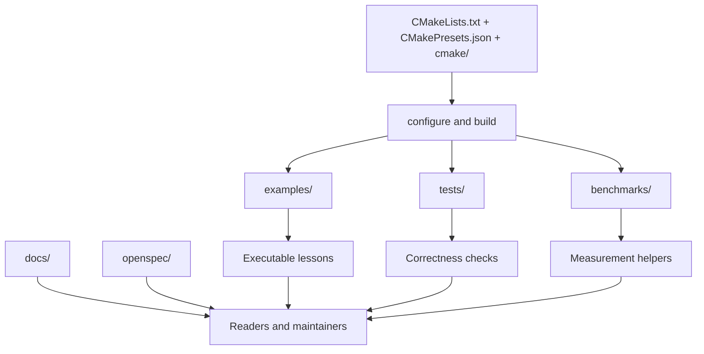

# Repository Topology

This page names the structural layers that make the repository readable as a technical artifact. The goal is not to list every file. It is to show where teaching code, reusable helpers, validation machinery, publication surfaces, and governance records sit relative to one another.

## Top-level map

## Structural layers

| Layer | Main paths | Role | Typical maintainer question |
| --- | --- | --- | --- |
| Build policy | `CMakeLists.txt`, `CMakePresets.json`, `cmake/` | Declares language level, dependencies, sanitizer support, and reproducible build entry points | How do binaries, tests, and benchmarks come into existence? |
| Teaching modules | `examples/01-cmake-modern/` through `examples/05-concurrency/` | Self-contained example clusters for one performance topic at a time | Where is the executable argument for this concept? |
| Shared headers and helpers | `include/hpc/`, example-local `include/`, `benchmarks/common/` | Keeps reusable code explicit without hiding the lesson behind a large library | Which utilities are shared, and which are deliberately local to a module? |
| Validation | `tests/unit/`, `tests/property/`, `ctest` presets | Protects behavior and low-level invariants | What would fail if this assumption were false? |
| Publication | `docs/` | Presents the whitepaper, playbooks, and reference routes | Where is the explanation for a skeptical reader? |
| Governance | `openspec/`, `AGENTS.md`, `CLAUDE.md` | Records change intent and maintenance rules | Why was a structural choice made, and how should it evolve? |

## Directory-level reading guide

| Path | What lives there | Why it matters |
| --- | --- | --- |
| `examples/` | runnable modules grouped by topic | the center of gravity for the repository's teaching value |
| `tests/unit/` | small, target-specific checks | confirms that helper types and examples preserve expected behavior |
| `tests/property/` | invariant-oriented checks | stresses assumptions beyond a handful of example inputs |
| `benchmarks/common/` | shared benchmark support | keeps measurement helpers centralized without turning the repo into a general-purpose framework |
| `tools/performance/` | scripts for flamegraphs and benchmark comparison | bridges raw execution data and analysis |
| `docs/.vitepress/` | docs configuration, theme primitives, and docs tests | keeps the publication layer versioned and locally verifiable |
| `openspec/changes/` | active and archived change records | documents why non-trivial repository changes happened |

## Topology by workflow

### If you are investigating a performance claim

1. Start with the relevant example module under `examples/`.
2. Find the benchmark executable path produced by that module.
3. Check whether supporting unit or property tests exist under `tests/`.
4. Read the matching documentation page in [Academy](/en/academy/) or [Architecture](/en/architecture/).

### If you are maintaining the docs site

1. Start under `docs/` and `docs/.vitepress/`.
2. Confirm that new routes align with the current information architecture.
3. Run docs tests and Pages build output before you treat a page as finished.
4. Keep repository-level guidance aligned with `openspec/` and root docs.

### If you are auditing maintainability

Inspect how little magic is required to move through the repository:

- presets are declared publicly in `CMakePresets.json`
- example modules are named by topic and order
- docs routes correspond to explicit site sections
- governance records live alongside the code, not in external tooling

That low indirection is deliberate. It is one of the reasons the repository is maintainable in closure and hardening mode.
