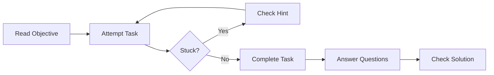

# Interactive Exercises

Practice your HPC optimization skills with hands-on exercises for each module.

---

## Exercise Philosophy

These exercises are designed to:
1. **Reinforce concepts** from the learning modules
2. **Provide practical experience** with optimization techniques
3. **Build intuition** through trial and error
4. **Test your understanding** with self-assessment questions

---

## Exercise Modules

| Module | Difficulty | Focus |
|--------|------------|-------|
| [Module 02: Memory](module-02-memory.md) | Beginner | Cache optimization |
| [Module 04: SIMD](module-04-simd.md) | Intermediate | Vectorization |
| [Module 05: Concurrency](module-05-concurrency.md) | Advanced | Multithreading |

---

## How to Use These Exercises

### Exercise Format

Each exercise includes:
1. **Objective** - What you will learn
2. **Setup** - Files and commands needed
3. **Tasks** - Step-by-step instructions
4. **Questions** - Self-assessment questions
5. **Hints** - Optional guidance (try without first!)

### Recommended Approach



1. **Try first** - Attempt the exercise before looking at hints
2. **Experiment** - Modify parameters and observe results
3. **Measure** - Always verify with benchmarks
4. **Understand** - Ask "why does this work?"

---

## Solution Format

Solutions are provided in [solutions.md](solutions.md), but we encourage you to:

1. Attempt each exercise independently
2. Use hints if you get stuck
3. Only check solutions after completing the exercise
4. Understand *why* the solution works

---

## Environment Setup

### Prerequisites

```bash
# Clone the repository
git clone https://github.com/LessUp/cpp-high-performance-guide.git
cd cpp-high-performance-guide

# Build the project
cmake --preset=release
cmake --build build/release

# Run tests to verify setup
ctest --preset=release
```

### Required Tools

- **Compiler**: GCC 11+ or Clang 14+
- **CMake**: 3.20+
- **perf**: For profiling exercises (Linux)
- **ThreadSanitizer**: For concurrency exercises

---

## Progress Tracking

Track your progress through each module:

| Module | Completed | Notes |
|--------|-----------|-------|
| 01. CMake | ☐ | |
| 02. Memory | ☐ | |
| 03. Modern C++ | ☐ | |
| 04. SIMD | ☐ | |
| 05. Concurrency | ☐ | |

---

## Getting Help

If you're stuck:
1. Review the relevant module README
2. Check the [FAQ](../reference/faq.md)
3. Look at the [Troubleshooting Guide](../reference/troubleshooting.md)
4. [Open a Discussion](https://github.com/LessUp/cpp-high-performance-guide/discussions)

---

## Next Steps

Choose a module and start practicing:

- **New to the project?** Start with [Module 02: Memory](module-02-memory.md)
- **Want immediate results?** Try the memory exercises above
- **Ready for advanced topics?** Jump to [Module 05: Concurrency](module-05-concurrency.md)
