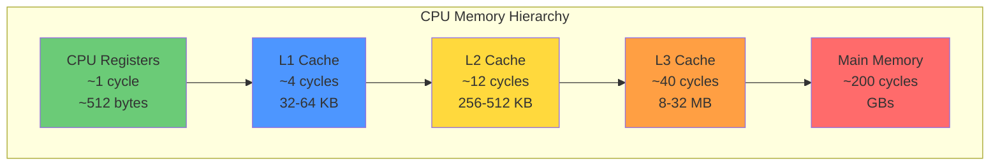

# Learning Path

This guide provides a recommended order for studying the HPC optimization examples, organized from beginner to advanced topics.

---

## Memory Hierarchy Overview

Understanding the memory hierarchy is fundamental to performance optimization:



**Key Insight:** Each level is ~10x slower than the previous. Optimizations that improve cache utilization yield the biggest gains.

---

## Learning Flowchart


---

## Prerequisites

Before starting, ensure you have:
- Basic C++ knowledge (classes, templates, STL)
- Familiarity with command-line tools
- Understanding of basic computer architecture concepts

See [Prerequisites](../getting-started/prerequisites.md) for details.

---

## Phase 1: Build System Fundamentals

### 1.1 Modern CMake ([examples/01-cmake-modern](https://github.com/LessUp/cpp-high-performance-guide/tree/master/examples/01-cmake-modern))

Start here to understand the project structure and build system.

**Topics:**
- Why target-based CMake is better than directory-based
- Using `target_include_directories` vs `include_directories`
- FetchContent for dependency management
- CMake presets for reproducible builds

**Exercises:**
1. Build the project using different presets
2. Add a new example module using the template
3. Compare the anti-pattern and best-practice CMakeLists.txt files

---

## Phase 2: Memory Fundamentals

### 2.1 Data Layout - AOS vs SOA ([examples/02-memory-cache](https://github.com/LessUp/cpp-high-performance-guide/tree/master/examples/02-memory-cache))

Understanding data layout is fundamental to cache optimization.

**Key Concepts:**
- Cache lines and spatial locality
- Array of Structures vs Structure of Arrays
- When to use each layout

**Benchmark:**
```bash
./build/release/examples/02-memory-cache/bench/aos_soa_bench
```

### 2.2 Memory Alignment

Learn how alignment affects SIMD performance.

**Key Concepts:**
- `alignas` specifier
- Aligned memory allocation
- SIMD alignment requirements

### 2.3 False Sharing

Critical for multi-threaded performance.

**Key Concepts:**
- Cache line contention
- `alignas(64)` for cache line padding
- Detecting false sharing with perf

### 2.4 Prefetching

Advanced memory optimization technique.

**Key Concepts:**
- `__builtin_prefetch` usage
- Prefetch distance tuning
- When prefetching helps (and when it doesn't)

---

## Phase 3: Modern C++ Performance

### 3.1 Compile-Time Computation ([examples/03-modern-cpp](https://github.com/LessUp/cpp-high-performance-guide/tree/master/examples/03-modern-cpp))

Move computation from runtime to compile time.

**Key Concepts:**
- `constexpr` functions and variables
- `consteval` for guaranteed compile-time evaluation
- Template metaprogramming basics

### 3.2 Move Semantics

Avoid unnecessary copies.

**Key Concepts:**
- Rvalue references
- Move constructors and assignment
- `std::move` usage

### 3.3 Vector Capacity

Optimize container usage.

**Key Concepts:**
- `reserve()` vs automatic growth
- Allocation counting
- Capacity vs size

### 3.4 C++20 Ranges

Modern iteration patterns.

**Key Concepts:**
- Range adaptors and views
- Lazy evaluation
- Performance comparison with raw loops

---

## Phase 4: SIMD Vectorization

### 4.1 Auto-Vectorization ([examples/04-simd-vectorization](https://github.com/LessUp/cpp-high-performance-guide/tree/master/examples/04-simd-vectorization))

Let the compiler do the work.

**Key Concepts:**
- Vectorization-friendly code patterns
- Compiler vectorization reports
- Common vectorization blockers

**Compiler flags:**
```bash
# GCC vectorization report
-fopt-info-vec-optimized

# Clang vectorization report
-Rpass=loop-vectorize
```

**Repository workflow:**
```bash
cmake --preset=release -DHPC_VECTORIZE_REPORT=ON
cmake --build build/release --target auto_vectorize
```

`HPC_VECTORIZE_REPORT` enables the same compiler-specific diagnostics for the
example target while keeping the default preset list stable. For sanitizer-led
verification after SIMD changes, see
[Validation & Sanitizers](./validation.md).

### 4.2 SIMD Intrinsics

Manual vectorization for maximum control.

**Key Concepts:**
- SSE, AVX2, AVX-512 instruction sets
- Intrinsic functions
- Data alignment for SIMD

### 4.3 SIMD Wrapper

Readable SIMD code.

**Key Concepts:**
- Abstracting intrinsics
- Scalar fallback implementations
- Type-safe SIMD operations
- Runtime dispatch for mixed CPU fleets

---

## Phase 5: Concurrent Programming

### 5.1 Atomic Operations ([examples/05-concurrency](https://github.com/LessUp/cpp-high-performance-guide/tree/master/examples/05-concurrency))

Foundation of lock-free programming.

**Key Concepts:**
- `std::atomic` basics
- Memory orderings (relaxed, acquire, release, seq_cst)
- When to use each ordering

### 5.2 Lock-Free Queue

Practical lock-free data structure.

**Key Concepts:**
- SPSC queue design
- Memory ordering in practice
- Correctness verification

### 5.3 OpenMP

Simple parallelization.

**Key Concepts:**
- `#pragma omp parallel for`
- Reductions
- Thread scaling

---

## Phase 6: Profiling & Analysis

### 6.1 Benchmarking

Learn to measure accurately.

**Topics:**
- Google Benchmark usage
- `DoNotOptimize` and `ClobberMemory`
- Parameterized benchmarks

### 6.2 Profiling

Find performance bottlenecks.

**Tools:**
- `perf` for CPU profiling
- FlameGraph visualization
- Cache miss analysis

See [Profiling Guide](profiling-guide.md) for detailed instructions.

---

## Recommended Study Schedule

| Week | Topics |
|------|--------|
| 1 | Phase 1 + Phase 2.1-2.2 |
| 2 | Phase 2.3-2.4 + Phase 3.1-3.2 |
| 3 | Phase 3.3-3.4 + Phase 4.1 |
| 4 | Phase 4.2-4.3 |
| 5 | Phase 5.1-5.2 |
| 6 | Phase 5.3 + Phase 6 |

---

## Next Steps

After completing this learning path:
1. Profile your own code to find bottlenecks
2. Apply relevant optimizations
3. Measure the improvement
4. [Contribute new examples to this project!](https://github.com/LessUp/cpp-high-performance-guide/blob/master/CONTRIBUTING.md)

---

## Related Resources

- [Best Practices](best-practices.md) - Industry-tested patterns
- [API Reference](../reference/api-reference.md) - Utility functions
- [FAQ](../reference/faq.md) - Common questions
