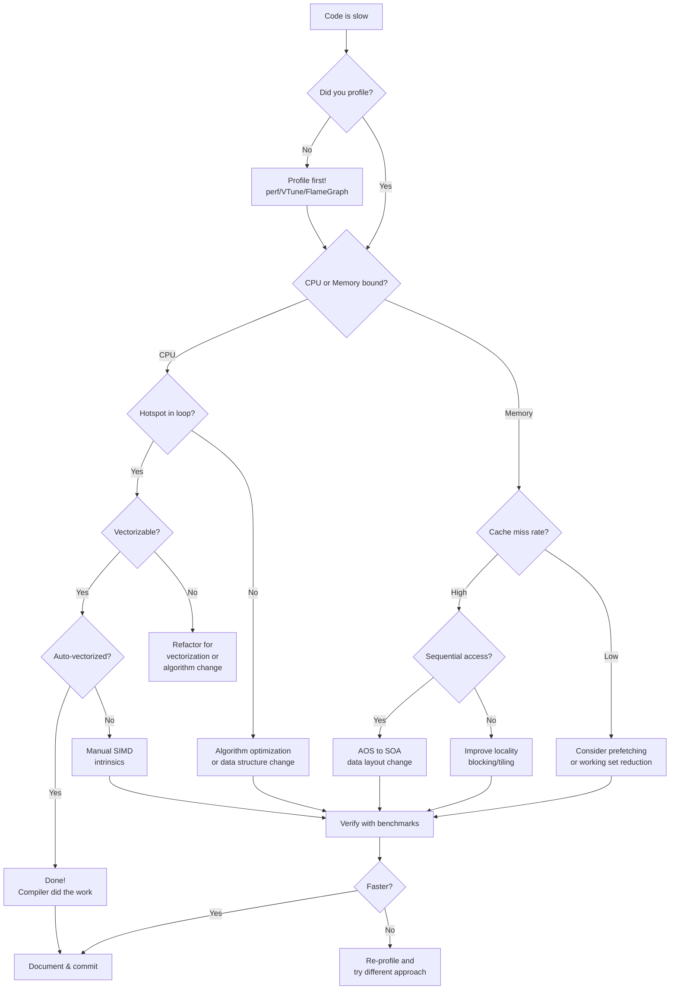
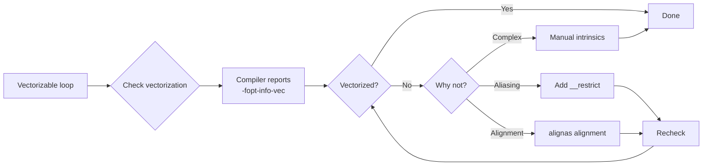
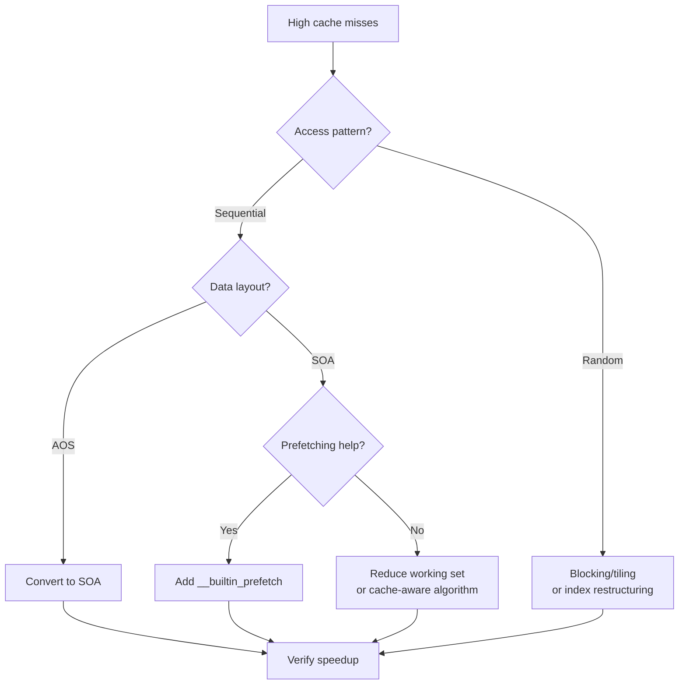
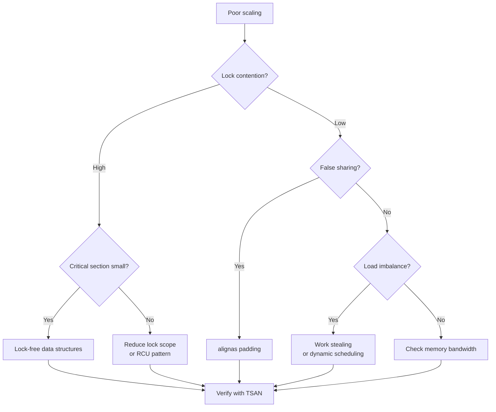
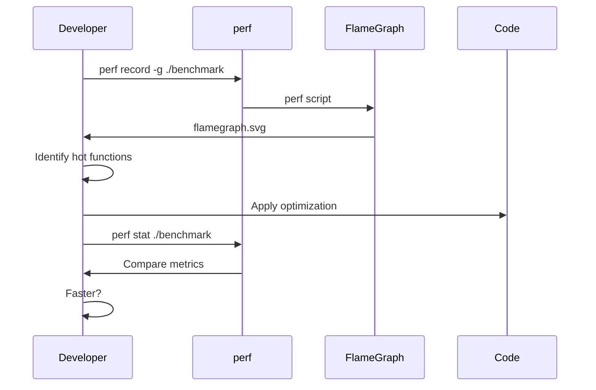

# Performance Optimization Decision Tree

This guide helps you navigate the optimization process with a structured decision framework.

---

## Overview

Performance optimization is not random—it follows a systematic approach. This decision tree helps you identify the right optimization technique for your specific situation.

---

## The Golden Rule

> **Always profile before optimizing!**
>
> Premature optimization is the root of all evil (or at least most of it) in programming.
> — Donald Knuth

---

## Decision Flowchart

<DiagramCanvas title="Optimization Decision Flow" badge="Mermaid" caption="Semantic colors: yellow = decision, blue = action, green = complete, red = problem, gray = start.">



</DiagramCanvas>

---

## Quick Diagnosis Checklist

### CPU-Bound Symptoms

| Indicator | Command | Threshold |
|-----------|---------|-----------|
| High CPU utilization | `perf stat` | > 80% CPU busy |
| Low cache miss rate | `perf stat -e cache-misses` | < 1% LLC miss |
| Hot loops in profile | `perf report` | Single loop dominates |

**Go to:** [SIMD Optimization](#simd-optimization)

### Memory-Bound Symptoms

| Indicator | Command | Threshold |
|-----------|---------|-----------|
| High cache misses | `perf stat -e cache-misses` | > 5% LLC miss |
| Memory bandwidth saturated | `perf stat -e bus-cycles` | Near peak |
| Long memory latency | `perf mem` | High latency |

**Go to:** [Memory Optimization](#memory-optimization)

### Concurrency Issues

| Indicator | Command | Detection |
|-----------|---------|-----------|
| Poor thread scaling | `OMP_NUM_THREADS` varying | Speedup < 0.5 times threads |
| Lock contention | `perf record -e lock:*` | High lock wait time |
| Data races | `cmake --preset=tsan` | TSAN reports races |

**Go to:** [Concurrency Optimization](#concurrency-optimization)

---

## Optimization Techniques by Category

### SIMD Optimization

<DiagramCanvas title="SIMD Optimization Flow" badge="Mermaid">



</DiagramCanvas>

**Key Techniques:**
1. **Auto-vectorization** - Let compiler do the work
2. **Alignment** - `alignas(64)` for SIMD-friendly data
3. **Restrict pointers** - `float* __restrict ptr`
4. **Manual intrinsics** - SSE/AVX/AVX-512 when compiler fails

**Reference:** [SIMD Module](https://github.com/LessUp/cpp-high-performance-guide/tree/master/examples/04-simd-vectorization)

### Memory Optimization

<DiagramCanvas title="Memory Optimization Flow" badge="Mermaid">



</DiagramCanvas>

**Key Techniques:**
1. **AOS to SOA** - Structure of Arrays for sequential access
2. **False sharing fix** - `alignas(64)` padding
3. **Prefetching** - `__builtin_prefetch` for predictable patterns
4. **Cache blocking** - Process data in cache-sized chunks

**Reference:** [Memory Module](https://github.com/LessUp/cpp-high-performance-guide/tree/master/examples/02-memory-cache)

### Concurrency Optimization

<DiagramCanvas title="Concurrency Optimization Flow" badge="Mermaid">



</DiagramCanvas>

**Key Techniques:**
1. **Atomic operations** - `std::atomic` with correct memory ordering
2. **Lock-free structures** - SPSC queues, lock-free stacks
3. **False sharing prevention** - Cache line padding
4. **OpenMP parallelization** - `#pragma omp parallel for`

**Reference:** [Concurrency Module](https://github.com/LessUp/cpp-high-performance-guide/tree/master/examples/05-concurrency)

---

## Decision Quick Reference

| Your Situation | First Try | Alternative |
|----------------|-----------|-------------|
| Loop runs many iterations | Auto-vectorization | Manual SIMD |
| Sequential data access, high cache miss | AOS to SOA | Prefetching |
| Multi-threaded, poor scaling | Check false sharing | Lock-free |
| Random memory access | Blocking/tiling | B-tree structure |
| High branch misprediction | Branchless code | Sort data |
| Small critical section | Lock-free | Fine-grained locks |

---

## Profiling Workflow

<DiagramCanvas title="Profiling Workflow" badge="Mermaid">



</DiagramCanvas>

---

## Common Pitfalls

### Premature Optimization

```cpp
// BAD: Optimizing without profiling
void process() {
    // "This loop looks slow, let me SIMD it"
    for (int i = 0; i < 10; ++i) { ... }  // Only 10 iterations!
}
```

**Fix:** Profile first. Small loops may not matter.

### Wrong Optimization for the Problem

```cpp
// BAD: Using SIMD for memory-bound code
void process(float* data, size_t n) {
    // Memory bandwidth saturated, SIMD won't help!
    for (size_t i = 0; i < n; ++i) {
        data[i] = data[i] * 2.0f;  // Memory-bound, not CPU-bound
    }
}
```

**Fix:** Check if CPU or memory bound first.

### Ignoring Algorithmic Complexity

```cpp
// BAD: Optimizing O(n^2) algorithm
for (int i = 0; i < n; ++i) {
    for (int j = 0; j < n; ++j) {  // O(n^2)
        // SIMD won't save you here
    }
}
```

**Fix:** Use better algorithm first (O(n log n) or O(n)).

---

## Next Steps

1. **Profile your code** using the [Profiling Guide](profiling-guide.md)
2. **Identify the bottleneck** using the decision tree above
3. **Apply the appropriate technique** from the relevant module
4. **Measure the improvement** with benchmarks
5. **Document your findings** for future reference

---

## Related Resources

- [Learning Path](learning-path.md) - Structured curriculum
- [Profiling Guide](profiling-guide.md) - How to profile
- [Best Practices](best-practices.md) - Industry patterns
- [FAQ](../reference/faq.md) - Common questions
