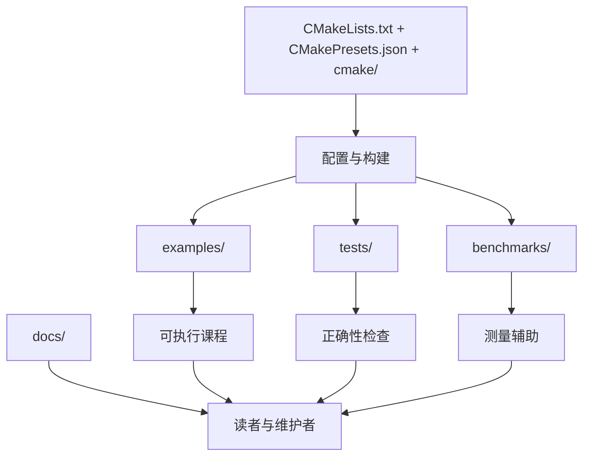

# 仓库拓扑

本页为这份技术成果标出使其可读的结构层次。目标不是枚举每一个文件，而是说明教学代码、可复用辅助、验证机制、发布表面与治理记录彼此如何定位。

## 顶层地图

## 结构层

| 层级 | 主要路径 | 角色 | 维护者常问的问题 |
| --- | --- | --- | --- |
| 构建策略 | `CMakeLists.txt`、`CMakePresets.json`、`cmake/` | 声明语言级别、依赖、sanitizer 支持与可复现的构建入口 | 二进制、测试与基准是如何生成的？ |
| 教学模块 | `examples/01-cmake-modern/` 到 `examples/05-concurrency/` | 围绕单一性能主题组织的自洽示例簇 | 这个概念的可执行论证在哪里？ |
| 共享头文件与辅助 | `include/hpc/`、各示例局部 `include/`、`benchmarks/common/` | 让可复用代码保持显式，同时避免被庞大库表面遮蔽教学重点 | 哪些工具是共享的，哪些故意只在模块内部存在？ |
| 验证 | `tests/unit/`、`tests/property/`、`ctest` preset | 保护行为与低层不变量 | 如果这个假设不成立，会在哪里失败？ |
| 发布 | `docs/` | 呈现白皮书、操作手册与参考入口 | 一个持怀疑态度的读者去哪里看解释？ |
| 治理 | `CLAUDE.md` | 记录维护规则与 AI 工作流指导 | 仓库应如何演进？ |

## 目录级阅读指南

| 路径 | 里面有什么 | 为什么重要 |
| --- | --- | --- |
| `examples/` | 按主题分组的可运行模块 | 这里是仓库教学价值的重心 |
| `tests/unit/` | 小而专注的目标级检查 | 确认辅助类型与示例仍保持预期行为 |
| `tests/property/` | 围绕不变量的检查 | 把验证压力扩展到少量示例输入之外 |
| `benchmarks/common/` | 共享基准支撑代码 | 把测量辅助集中管理，又不把仓库变成通用框架 |
| `tools/performance/` | FlameGraph 与基准比较脚本 | 连接原始执行数据与分析 |
| `docs/.vitepress/` | 文档配置、主题原语与文档测试 | 让发布层也能纳入版本控制并在本地验证 |

## 按工作流理解拓扑

### 如果你在调查一个性能结论

1. 从 `examples/` 下对应的示例模块开始。
2. 找到该模块生成的基准可执行文件路径。
3. 检查 `tests/` 下是否存在配套的单元或性质测试。
4. 阅读学院或架构中的对应页面，也就是[学院](/zh/academy/)或[架构](/zh/architecture/)。

### 如果你在维护文档站

1. 从 `docs/` 与 `docs/.vitepress/` 开始。
2. 确认新路由与当前信息架构一致。
3. 在把页面视为完成前，先运行文档测试与 Pages 构建输出。

### 如果你在审查可维护性

可以检查仓库是否几乎不依赖隐式魔法：

- preset 明确声明在 `CMakePresets.json`
- 示例模块按主题与顺序命名
- 文档路由对应清晰的站点分区
- 治理记录与代码放在同一仓库，而不是藏在外部工具中

这种低间接性是刻意为之，也是仓库能在收口与加固阶段继续保持可维护的重要原因之一。