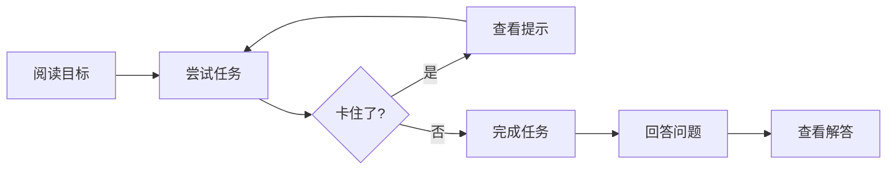

# 交互式练习

通过动手练习来提升你的 HPC 优化技能。

---

## 练习理念

这些练习旨在：
1. **巩固概念** - 强化学习模块中的知识
2. **提供实践经验** - 实际操作优化技术
3. **通过试错建立直觉** - 在实践中学习
4. **测试理解程度** - 通过自评问题检验学习效果

---

## 练习模块

| 模块 | 难度 | 重点 |
|------|------|------|
| [模块 02：内存优化](module-02-memory.md) | 初级 | 缓存优化 |
| [模块 04：SIMD](module-04-simd.md) | 中级 | 向量化 |
| [模块 05：并发](module-05-concurrency.md) | 高级 | 多线程 |

---

## 如何使用这些练习

### 练习格式

每个练习包含：
1. **目标** - 你将学到什么
2. **准备** - 所需的文件和命令
3. **任务** - 分步指南
4. **问题** - 自评问题
5. **提示** - 可选指导（请先尝试自己完成！）

### 推荐方法



1. **先尝试** - 在查看提示之前独立完成练习
2. **实验** - 修改参数并观察结果
3. **测量** - 始终通过基准测试验证
4. **理解** - 问"为什么这样有效？"

---

## 解答格式

解答在 [solutions.md](solutions.md) 中提供，但我们鼓励你：

1. 独立尝试每个练习
2. 如果卡住可以使用提示
3. 完成练习后再查看解答
4. 理解解答*为什么*有效

---

## 环境准备

### 前置条件

```bash
# 克隆仓库
git clone https://github.com/LessUp/cpp-high-performance-guide.git
cd cpp-high-performance-guide

# 构建项目
cmake --preset=release
cmake --build build/release

# 运行测试验证环境
ctest --preset=release
```

### 所需工具

- **编译器**：GCC 11+ 或 Clang 14+
- **CMake**：3.20+
- **perf**：用于性能分析练习（Linux）
- **ThreadSanitizer**：用于并发练习

---

## 进度追踪

追踪你在各模块的进度：

| 模块 | 已完成 | 备注 |
|------|--------|------|
| 01. CMake | ☐ | |
| 02. 内存优化 | ☐ | |
| 03. 现代 C++ | ☐ | |
| 04. SIMD | ☐ | |
| 05. 并发 | ☐ | |

---

## 获取帮助

如果遇到困难：
1. 复习相关模块的 README
2. 查看 [FAQ](../reference/faq.md)
3. 参考 [故障排除指南](../reference/troubleshooting.md)
4. [开启讨论](https://github.com/LessUp/cpp-high-performance-guide/discussions)

---

## 下一步

选择一个模块开始练习：

- **刚接触本项目？** 从 [模块 02：内存优化](module-02-memory.md) 开始
- **想要立竿见影？** 尝试上面的内存练习
- **准备学习高级主题？** 直接进入 [模块 05：并发](module-05-concurrency.md)
