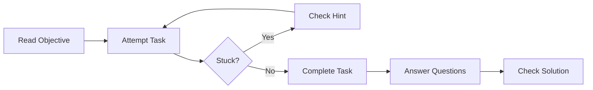

# 交互式练习

通过各模块的动手练习来训练你的 HPC 优化技能。

---

## 练习理念

这些练习旨在：
1. **巩固概念**——强化学习模块中的知识点
2. **提供实践经验**——亲手运用优化技术
3. **培养直觉**——在反复试错中建立判断力
4. **检验理解**——通过自测问题评估掌握程度

---

## 练习模块

| 模块 | 难度 | 主题 |
|--------|------------|-------|
| [模块 02：Memory](module-02-memory.md) | 初级 | cache 优化 |
| [模块 04：SIMD](module-04-simd.md) | 中级 | 向量化 |
| [模块 05：Concurrency](module-05-concurrency.md) | 高级 | 多线程 |

---

## 如何使用这些练习

### 练习格式

每个练习包含：
1. **目标**——你将学到什么
2. **准备**——所需的文件与命令
3. **任务**——分步操作指引
4. **问题**——自测问题
5. **提示**——可选的引导（建议先独立尝试！）

### 推荐流程



1. **先独立尝试**——在看提示之前先自己动手
2. **多做实验**——修改参数并观察结果
3. **始终测量**——用 benchmark 验证每一次改动
4. **理解原理**——多问"为什么这样有效？"

---

## 解答格式

解答见 [solutions.md](solutions.md)，但我们建议你：

1. 先独立完成每个练习
2. 卡住时再查看提示
3. 完成练习后才核对解答
4. 理解解答*为什么*有效

---

## 环境准备

### 前置条件

```bash
# Clone the repository
git clone https://github.com/LessUp/cpp-high-performance-guide.git
cd cpp-high-performance-guide

# Build the project
cmake --preset=release
cmake --build build/release

# Run tests to verify setup
ctest --preset=release
```

### 所需工具

- **编译器**：GCC 11+ 或 Clang 14+
- **CMake**：3.20+
- **perf**：用于性能分析练习（Linux）
- **ThreadSanitizer**：用于并发练习

---

## 进度跟踪

跟踪你在各模块中的进度：

| 模块 | 已完成 | 备注 |
|--------|-----------|-------|
| 01. CMake | ☐ | |
| 02. Memory | ☐ | |
| 03. Modern C++ | ☐ | |
| 04. SIMD | ☐ | |
| 05. Concurrency | ☐ | |

---

## 获取帮助

如果你卡住了：
1. 复习相关模块的 README
2. 查看 [FAQ](../reference/faq.md)
3. 参阅 [故障排查指南](../reference/troubleshooting.md)
4. [发起讨论](https://github.com/LessUp/cpp-high-performance-guide/discussions)

---

## 后续步骤

选择一个模块开始练习：

- **初次接触本项目？** 从 [模块 02：Memory](module-02-memory.md) 开始
- **想快速看到效果？** 尝试上面的 memory 练习
- **准备好挑战高级主题？** 直接跳到 [模块 05：Concurrency](module-05-concurrency.md)
