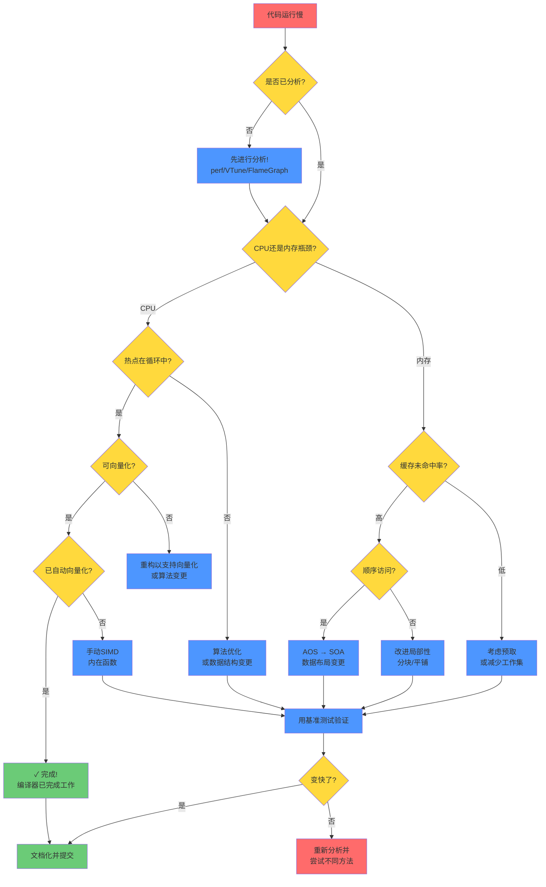
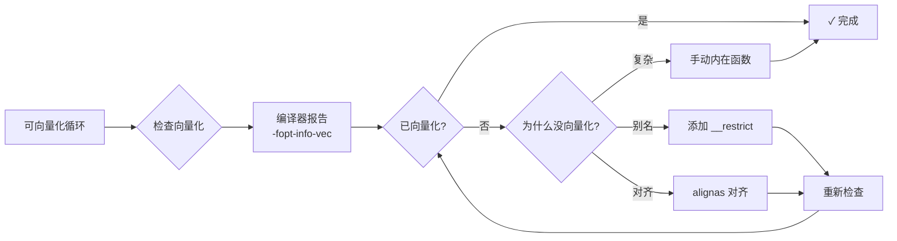
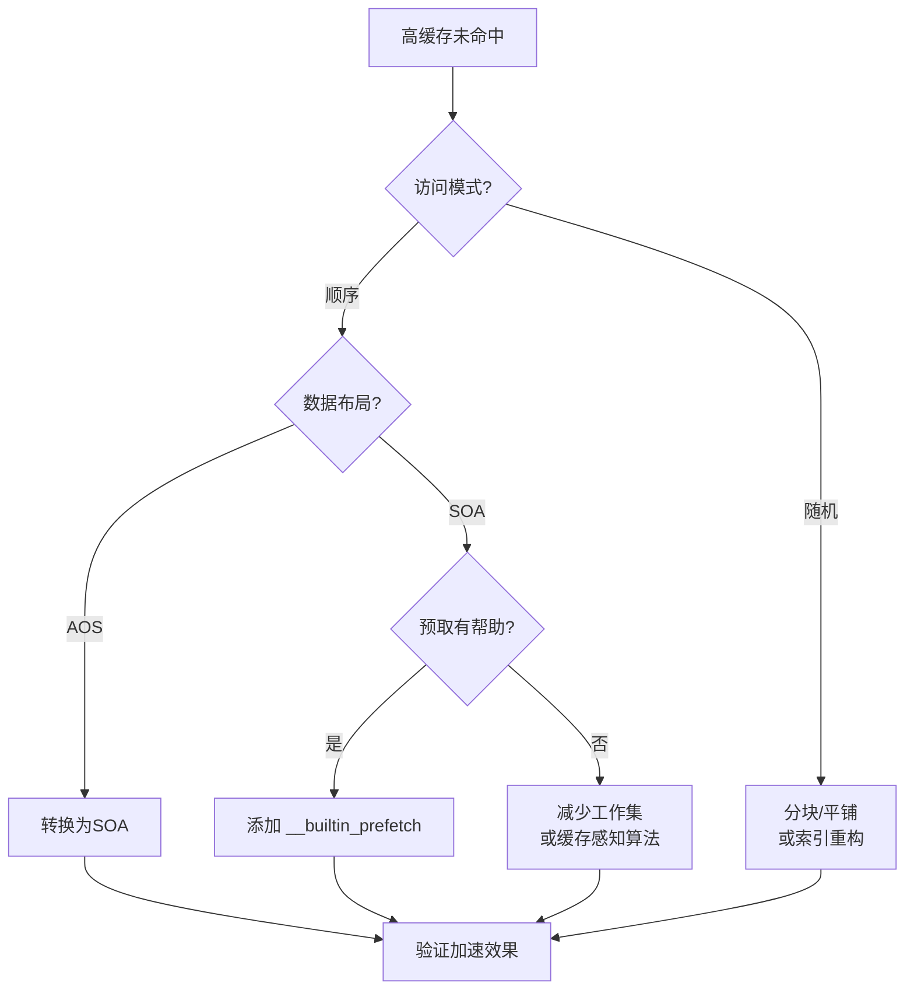
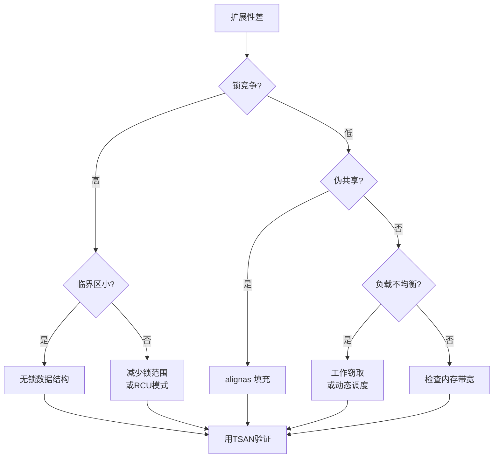
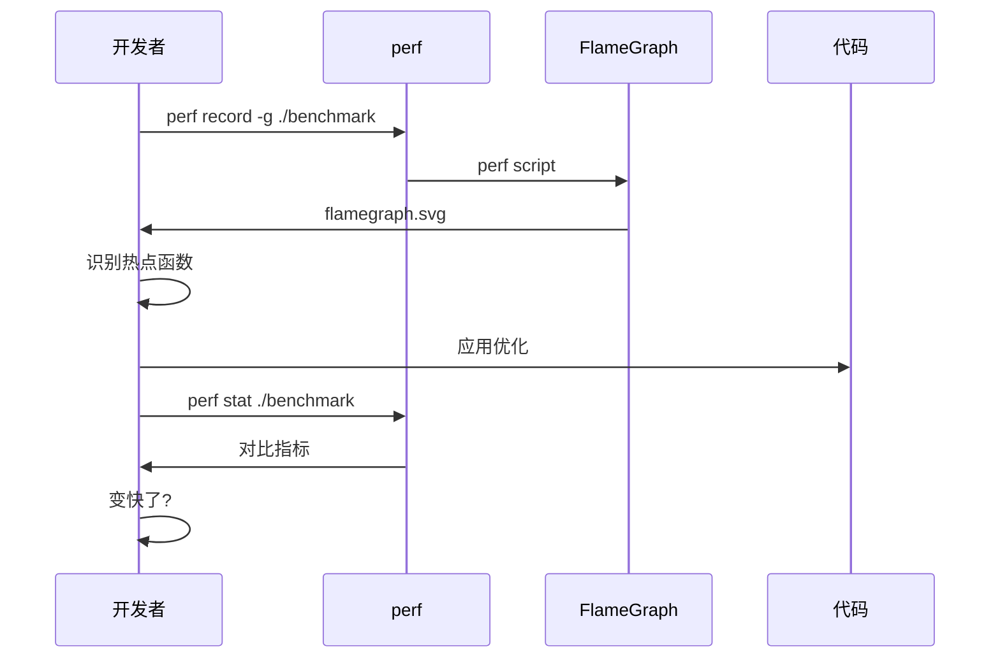

# 性能优化决策树

本指南帮助您通过结构化的决策框架进行性能优化。

---

## 概述

性能优化不是随机的——它遵循系统化的方法。这个决策树帮助您针对特定情况识别正确的优化技术。

---

## 黄金法则

> **优化前一定要先分析！**
>
> 过早优化是编程中所有罪恶（或者至少大部分罪恶）的根源。
> — Donald Knuth

---

## 决策流程图



---

## 快速诊断清单

### CPU瓶颈症状

| 指标 | 命令 | 阈值 |
|-----|------|------|
| 高CPU利用率 | `perf stat` | CPU忙碌 > 80% |
| 低缓存未命中率 | `perf stat -e cache-misses` | LLC未命中 < 1% |
| 分析中热点循环 | `perf report` | 单循环占主导 |

**跳转到：** [SIMD优化](#simd优化)

### 内存瓶颈症状

| 指标 | 命令 | 阈值 |
|-----|------|------|
| 高缓存未命中 | `perf stat -e cache-misses` | LLC未命中 > 5% |
| 内存带宽饱和 | `perf stat -e bus-cycles` | 接近峰值 |
| 长内存延迟 | `perf mem` | 高延迟 |

**跳转到：** [内存优化](#内存优化)

### 并发问题

| 指标 | 命令 | 检测方式 |
|-----|------|---------|
| 线程扩展性差 | 变化 `OMP_NUM_THREADS` | 加速比 < 0.5 × 线程数 |
| 锁竞争 | `perf record -e lock:*` | 高锁等待时间 |
| 数据竞争 | `cmake --preset=tsan` | TSAN报告竞争 |

**跳转到：** [并发优化](#并发优化)

---

## 按类别分类的优化技术

### SIMD优化



**关键技术：**
1. **自动向量化** - 让编译器完成工作
2. **对齐** - `alignas(64)` 用于SIMD友好数据
3. **Restrict指针** - `float* __restrict ptr`
4. **手动内在函数** - 当编译器失败时使用SSE/AVX/AVX-512

**参考：** [SIMD模块](https://github.com/LessUp/cpp-high-performance-guide/tree/master/examples/04-simd-vectorization)

### 内存优化



**关键技术：**
1. **AOS → SOA** - 数组结构体用于顺序访问
2. **伪共享修复** - `alignas(64)` 填充
3. **预取** - `__builtin_prefetch` 用于可预测模式
4. **缓存分块** - 按缓存大小分块处理数据

**参考：** [内存模块](https://github.com/LessUp/cpp-high-performance-guide/tree/master/examples/02-memory-cache)

### 并发优化



**关键技术：**
1. **原子操作** - 带正确内存序的 `std::atomic`
2. **无锁结构** - SPSC队列、无锁栈
3. **伪共享预防** - 缓存行填充
4. **OpenMP并行化** - `#pragma omp parallel for`

**参考：** [并发模块](https://github.com/LessUp/cpp-high-performance-guide/tree/master/examples/05-concurrency)

---

## 决策快速参考

| 您的情况 | 首选方案 | 替代方案 |
|---------|---------|---------|
| 循环迭代次数多 | 自动向量化 | 手动SIMD |
| 顺序数据访问，高缓存未命中 | AOS → SOA | 预取 |
| 多线程，扩展性差 | 检查伪共享 | 无锁 |
| 随机内存访问 | 分块/平铺 | B树结构 |
| 高分支预测错误 | 无分支代码 | 排序数据 |
| 小临界区 | 无锁 | 细粒度锁 |

---

## 分析工作流程



---

## 常见陷阱

### ❌ 过早优化

```cpp
// 错误：没有分析就优化
void process() {
    // "这个循环看起来很慢，让我SIMD化它"
    for (int i = 0; i < 10; ++i) { ... }  // 只有10次迭代！
}
```

**修复：** 先分析。小循环可能不重要。

### ❌ 对问题使用错误的优化

```cpp
// 错误：对内存瓶颈代码使用SIMD
void process(float* data, size_t n) {
    // 内存带宽已饱和，SIMD不会有帮助！
    for (size_t i = 0; i < n; ++i) {
        data[i] = data[i] * 2.0f;  // 内存瓶颈，不是CPU瓶颈
    }
}
```

**修复：** 先检查是CPU还是内存瓶颈。

### ❌ 忽略算法复杂度

```cpp
// 错误：优化O(n²)算法
for (int i = 0; i < n; ++i) {
    for (int j = 0; j < n; ++j) {  // O(n²)
        // SIMD救不了你
    }
}
```

**修复：** 先使用更好的算法（O(n log n) 或 O(n)）。

---

## 下一步

1. 使用 [性能分析指南](profiling-guide.md) **分析您的代码**
2. 使用上面的决策树 **识别瓶颈**
3. 从相关模块 **应用适当的技术**
4. 用基准测试 **度量改进**
5. **文档化您的发现** 供将来参考

---

## 相关资源

- [学习路径](learning-path.md) - 结构化课程
- [性能分析指南](profiling-guide.md) - 如何分析
- [最佳实践](best-practices.md) - 工业级模式
- [常见问题](../reference/faq.md) - 常见问题
