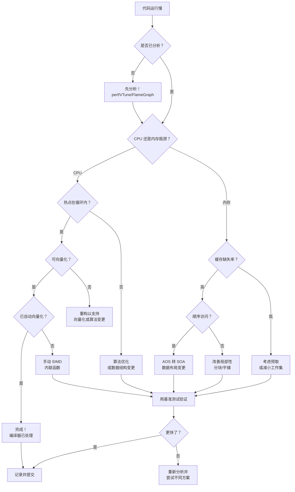
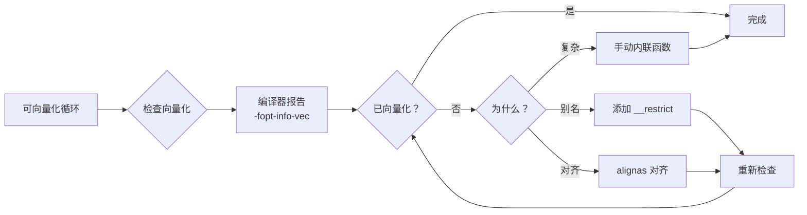
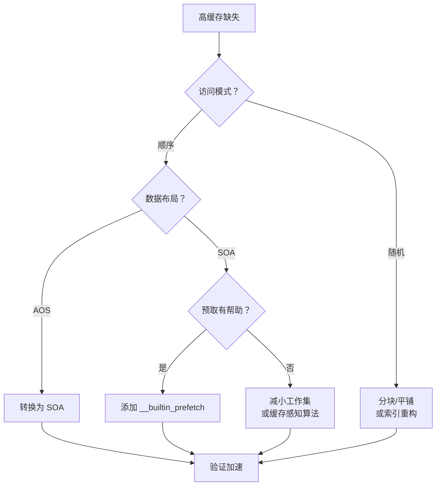
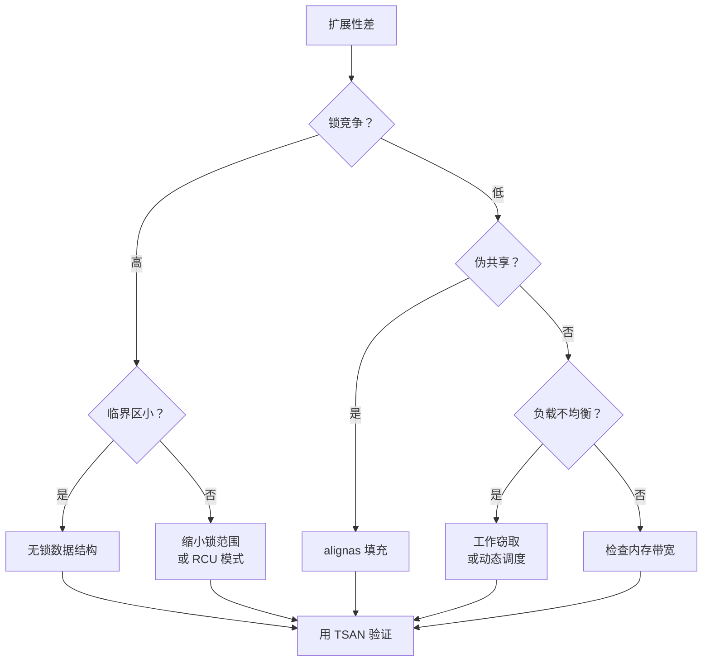

# 性能优化决策树

本指南帮助你通过结构化的决策框架来导航优化过程。

---

## 概览

性能优化不是随意的——它遵循系统化的方法。这个决策树帮助你为特定情境找到正确的优化技术。

---

## 黄金法则

> **优化前务必先性能分析！**
>
> 过早优化是编程中万恶之源（或至少大部分）。
> —— Donald Knuth

---

## 决策流程图

<DiagramCanvas title="优化决策流程" badge="Mermaid" caption="语义颜色：黄 = 决策，蓝 = 行动，绿 = 完成，红 = 问题，灰 = 起点。">



</DiagramCanvas>

---

## 快速诊断清单

### CPU 瓶颈症状

| 指标 | 命令 | 阈值 |
| --- | --- | --- |
| 高 CPU 利用率 | `perf stat` | > 80% CPU 繁忙 |
| 低缓存缺失率 | `perf stat -e cache-misses` | < 1% LLC 缺失 |
| 分析中热点循环 | `perf report` | 单个循环占主导 |

**前往：** [SIMD 优化](#simd-优化)

### 内存瓶颈症状

| 指标 | 命令 | 阈值 |
| --- | --- | --- |
| 高缓存缺失 | `perf stat -e cache-misses` | > 5% LLC 缺失 |
| 内存带宽饱和 | `perf stat -e bus-cycles` | 接近峰值 |
| 长内存延迟 | `perf mem` | 高延迟 |

**前往：** [内存优化](#内存-优化)

### 并发问题

| 指标 | 命令 | 检测方式 |
| --- | --- | --- |
| 线程扩展性差 | 变化 `OMP_NUM_THREADS` | 加速比 < 0.5 × 线程数 |
| 锁竞争 | `perf record -e lock:*` | 锁等待时间长 |
| 数据竞争 | `cmake --preset=tsan` | TSAN 报告竞争 |

**前往：** [并发优化](#并发-优化)

---

## 按类别划分的优化技术

### SIMD 优化

<DiagramCanvas title="SIMD 优化流程" badge="Mermaid">



</DiagramCanvas>

**关键技术：**
1. **自动向量化** — 让编译器完成工作
2. **对齐** — `alignas(64)` 使数据 SIMD 友好
3. **受限指针** — `float* __restrict ptr`
4. **手动内联函数** — 编译器失败时使用 SSE/AVX/AVX-512

**参考：** [SIMD 模块](https://github.com/LessUp/cpp-high-performance-guide/tree/master/examples/04-simd-vectorization)

### 内存优化

<DiagramCanvas title="内存优化流程" badge="Mermaid">



</DiagramCanvas>

**关键技术：**
1. **AOS 转 SOA** — 顺序访问时用 Structure of Arrays
2. **伪共享修复** — `alignas(64)` 填充
3. **预取** — 对可预测模式使用 `__builtin_prefetch`
4. **缓存分块** — 按缓存大小处理数据

**参考：** [内存模块](https://github.com/LessUp/cpp-high-performance-guide/tree/master/examples/02-memory-cache)

### 并发优化

<DiagramCanvas title="并发优化流程" badge="Mermaid">



</DiagramCanvas>

**关键技术：**
1. **原子操作** — 带正确内存序的 `std::atomic`
2. **无锁结构** — SPSC 队列、无锁栈
3. **伪共享预防** — 缓存行填充
4. **OpenMP 并行化** — `#pragma omp parallel for`

**参考：** [并发模块](https://github.com/LessUp/cpp-high-performance-guide/tree/master/examples/05-concurrency)

---

## 决策速查表

| 你的情况 | 首先尝试 | 替代方案 |
| --- | --- | --- |
| 循环执行多次迭代 | 自动向量化 | 手动 SIMD |
| 顺序数据访问，高缓存缺失 | AOS 转 SOA | 预取 |
| 多线程，扩展性差 | 检查伪共享 | 无锁 |
| 随机内存访问 | 分块/平铺 | B-树结构 |
| 高分支预测失误 | 无分支代码 | 排序数据 |
| 小临界区 | 无锁 | 细粒度锁 |

---

## 性能分析工作流

<DiagramCanvas title="性能分析工作流" badge="Mermaid">


</DiagramCanvas>

---

## 常见陷阱

### 过早优化

```cpp
// 错误：未分析就优化
void process() {
    // "这个循环看起来慢，让我 SIMD 它"
    for (int i = 0; i < 10; ++i) { ... }  // 只有 10 次迭代！
}
```

**修复：** 先分析。小循环可能不重要。

### 为错误的问题使用错误的优化

```cpp
// 错误：对内存受限代码使用 SIMD
void process(float* data, size_t n) {
    // 内存带宽已饱和，SIMD 帮不上忙！
    for (size_t i = 0; i < n; ++i) {
        data[i] = data[i] * 2.0f;  // 内存受限，非 CPU 受限
    }
}
```

**修复：** 先检查是 CPU 还是内存瓶颈。

### 忽略算法复杂度

```cpp
// 错误：优化 O(n^2) 算法
for (int i = 0; i < n; ++i) {
    for (int j = 0; j < n; ++j) {  // O(n^2)
        // SIMD 救不了你
    }
}
```

**修复：** 先使用更好的算法（O(n log n) 或 O(n)）。

---

## 下一步

1. 使用[性能分析指南](profiling-guide.md) **分析你的代码**
2. 使用上述决策树 **识别瓶颈**
3. 从相关模块 **应用适当的技术**
4. 使用基准测试 **测量改进**
5. **记录你的发现**以供将来参考

---

## 相关资源

- [学习路径](learning-path.md) — 结构化课程
- [性能分析指南](profiling-guide.md) — 如何分析
- [最佳实践](best-practices.md) — 行业模式
- [常见问题](../reference/faq.md) — 常见问题
