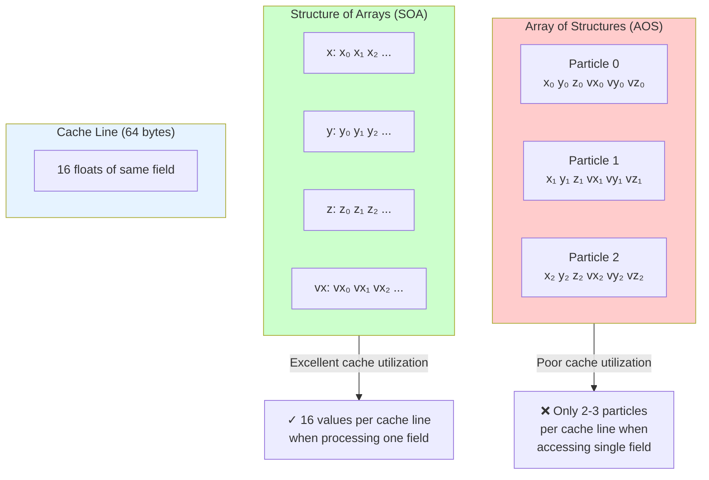
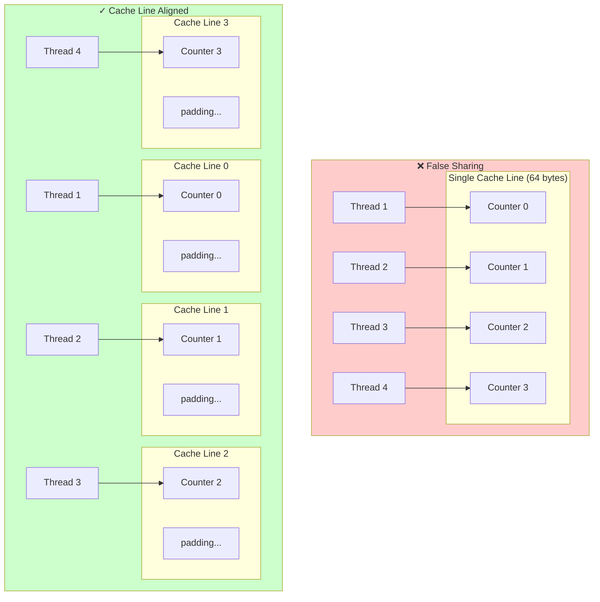

# 02 - Memory & Cache Optimization

<p align="center">
  
  
  
</p>

> Master memory and cache optimization techniques critical for high-performance computing.

Learn how data layout, alignment, and prefetching can deliver **2-20x performance improvements**.

---

## Memory Layout Visualization

### AOS vs SOA Memory Layout



**When updating all x coordinates:**
- AOS: Loads unnecessary y, z, vx, vy, vz data → Poor cache utilization
- SOA: Only loads x values → Maximum cache efficiency

---

## False Sharing Visualization



## Contents

| File | Topic | Key Concept |
|------|-------|-------------|
| `src/aos_vs_soa.cpp` | Data Layout | Cache-friendly data organization |
| `src/false_sharing.cpp` | False Sharing | Multi-threaded cache contention |
| `src/alignment.cpp` | Memory Alignment | SIMD-friendly allocation |
| `src/prefetch.cpp` | Prefetching | Manual cache hints |

## Key Concepts

### AOS vs SOA

**Array of Structures (AOS):**
```cpp
struct Particle { float x, y, z, vx, vy, vz; };
std::vector<Particle> particles;
```

**Structure of Arrays (SOA):**
```cpp
struct Particles {
    std::vector<float> x, y, z, vx, vy, vz;
};
```

SOA is faster for sequential access because it maximizes cache line utilization.

### False Sharing

When threads modify data on the same cache line, they cause expensive cache invalidations:

```cpp
// Bad: counters share cache line
int counters[4];

// Good: each counter on its own cache line
alignas(64) int counters[4][16];  // Padded
```

### Memory Alignment

SIMD instructions require aligned memory:

```cpp
// Aligned allocation
alignas(32) float data[1024];

// Or use aligned_alloc
float* data = static_cast<float*>(std::aligned_alloc(32, 1024 * sizeof(float)));
```

### Prefetching

Hint the CPU to load data before it's needed:

```cpp
for (size_t i = 0; i < n; ++i) {
    __builtin_prefetch(&data[i + 64], 0, 3);  // Prefetch ahead
    process(data[i]);
}
```

## Running Benchmarks

```bash
# Build
cmake --preset=release
cmake --build build/release

# Run all memory benchmarks
./build/release/examples/02-memory-cache/bench/aos_soa_bench
./build/release/examples/02-memory-cache/bench/false_sharing_bench
./build/release/examples/02-memory-cache/bench/alignment_bench
./build/release/examples/02-memory-cache/bench/prefetch_bench
```

## Expected Results

| Benchmark | Expected Speedup |
|-----------|------------------|
| SOA vs AOS | 2-4x |
| Aligned vs Unaligned (false sharing) | 5-20x |
| Aligned vs Unaligned (SIMD) | 1.5-3x |
| With Prefetch vs Without | 1.1-1.5x |

Results vary by CPU architecture and data size.

## Profiling Tips

Check cache misses:
```bash
perf stat -e cache-misses,cache-references ./build/release/examples/02-memory-cache/bench/aos_soa_bench
```

## Further Reading

- [What Every Programmer Should Know About Memory](https://people.freebsd.org/~lstewart/articles/cpumemory.pdf)
- [Gallery of Processor Cache Effects](http://igoro.com/archive/gallery-of-processor-cache-effects/)

---

## Common Pitfalls

### ❌ Assuming AOS is always bad

AOS can be better when accessing all fields together (e.g., particle physics where you need x, y, z, vx, vy, vz simultaneously).

### ❌ Over-aligning everything

Only data accessed in hot loops needs alignment. Don't waste memory aligning rarely-used data.

### ❌ Prefetching too early

Prefetch distance must match your access pattern. Too early = data evicted before use. Too late = no benefit.

### ❌ Forgetting to measure

Always benchmark before and after. Some "optimizations" can hurt performance on certain CPUs.

---

## Knowledge Check

Test your understanding:

1. **When should you prefer SOA over AOS?**
   <details>
   <summary>Click for answer</summary>
   When you process one field at a time (e.g., updating all x-coordinates). SOA improves cache utilization when access patterns are field-wise.
   </details>

2. **What cache line size do most modern x86 CPUs use?**
   <details>
   <summary>Click for answer</summary>
   64 bytes. This is why `alignas(64)` is used to prevent false sharing.
   </details>

3. **Why does false sharing hurt multi-threaded performance?**
   <details>
   <summary>Click for answer</summary>
   When multiple threads write to variables on the same cache line, the cache coherence protocol causes the line to "bounce" between cores, serializing access that should be parallel.
   </details>

---

## Next Steps

- Continue to [Modern C++ Features](../03-modern-cpp/) to learn about compile-time optimization
- Read the [Optimization Playbook](../../docs/zh/guides/optimization-playbook.md) for systematic optimization
- Read the [Memory Layout Deep Dive](../../docs/zh/deep-dives/memory-layout.md) for in-depth analysis
