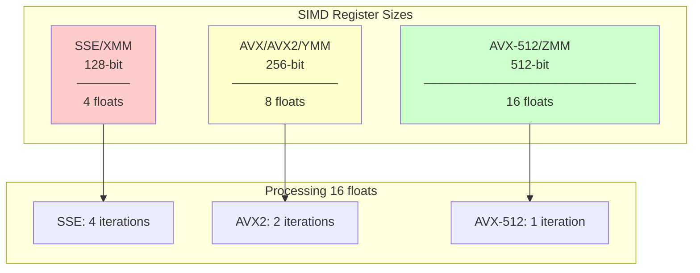
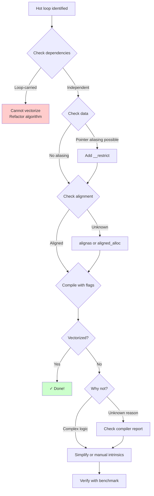

# 04 - SIMD Vectorization

<p align="center">
  
  
  
</p>

> Unlock CPU vector units for massive data parallelism with SIMD programming.

Learn auto-vectorization, SSE/AVX2/AVX-512 intrinsics, and write readable SIMD wrappers for **3-16x speedups**.

---

## SIMD Register Comparison



---

## Vectorization Decision Tree



## Contents

| File | Topic | Key Concept |
|------|-------|-------------|
| `src/auto_vectorize.cpp` | Auto-Vectorization | Compiler-friendly patterns |
| `src/intrinsics_intro.cpp` | SIMD Intrinsics | Manual SSE/AVX/AVX-512 |
| `src/dispatch_example_main.cpp` | Dispatch Demo | Runtime-gated array addition |

The canonical SIMD wrapper lives in [`include/hpc/simd.hpp`](../../include/hpc/simd.hpp) and provides the `hpc::simd` namespace used across these examples.

## Key Concepts

### Auto-Vectorization

Write code that compilers can automatically vectorize:

```cpp
// Good: simple loop, no dependencies
void add_arrays(float* a, const float* b, const float* c, size_t n) {
    for (size_t i = 0; i < n; ++i) {
        a[i] = b[i] + c[i];
    }
}

// Bad: loop-carried dependency
void prefix_sum(float* a, size_t n) {
    for (size_t i = 1; i < n; ++i) {
        a[i] += a[i-1];  // Depends on previous iteration
    }
}
```

Check vectorization with compiler flags:
```bash
# GCC
g++ -O3 -march=native -fopt-info-vec-optimized file.cpp

# Clang
clang++ -O3 -march=native -Rpass=loop-vectorize file.cpp
```

### SIMD Intrinsics

Manual vectorization for maximum control:

```cpp
#include <immintrin.h>

// SSE: 4 floats at once
void add_sse(float* a, const float* b, const float* c, size_t n) {
    for (size_t i = 0; i < n; i += 4) {
        __m128 vb = _mm_load_ps(&b[i]);
        __m128 vc = _mm_load_ps(&c[i]);
        __m128 va = _mm_add_ps(vb, vc);
        _mm_store_ps(&a[i], va);
    }
}

// AVX2: 8 floats at once
void add_avx2(float* a, const float* b, const float* c, size_t n) {
    for (size_t i = 0; i < n; i += 8) {
        __m256 vb = _mm256_load_ps(&b[i]);
        __m256 vc = _mm256_load_ps(&c[i]);
        __m256 va = _mm256_add_ps(vb, vc);
        _mm256_store_ps(&a[i], va);
    }
}
```

### SIMD Wrapper

Use the canonical `hpc::simd` module for readable SIMD code:

```cpp
#include <hpc/simd.hpp>

using Vec = hpc::simd::Vec256<float>;

void add_wrapped(float* a, const float* b, const float* c, size_t n) {
    for (size_t i = 0; i < n; i += Vec::size()) {
        Vec vb = Vec::load(&b[i]);
        Vec vc = Vec::load(&c[i]);
        Vec va = vb + vc;
        va.store(&a[i]);
    }
}
```

### Runtime Dispatch

Keep one binary and pick the best available path at runtime:

```bash
cmake --preset=release
cmake --build build/release --target dispatch_example
./build/release/examples/04-simd-vectorization/dispatch_example
```

`dispatch_add_arrays()` selects AVX2, SSE2, or scalar code at runtime. The
teaching goal is not to hide intrinsics, but to show how a small dispatch layer
lets one executable stay portable across mixed x86 CPUs.

## Instruction Sets

| ISA | Register Width | Floats/Op | Doubles/Op |
|-----|----------------|-----------|------------|
| SSE | 128-bit | 4 | 2 |
| AVX2 | 256-bit | 8 | 4 |
| AVX-512 | 512-bit | 16 | 8 |

## Running Benchmarks

```bash
cmake --preset=release
cmake --build build/release

./build/release/examples/04-simd-vectorization/bench/simd_bench
```

## Expected Results

| Implementation | Relative Speed |
|----------------|----------------|
| Scalar | 1x |
| Auto-vectorized | 2-4x |
| SSE | 3-4x |
| AVX2 | 6-8x |
| AVX-512 | 10-16x |

Actual speedup depends on:
- CPU architecture
- Memory bandwidth
- Data alignment
- Operation complexity

## CPU Feature Detection

Check your CPU capabilities:
```bash
# Linux
cat /proc/cpuinfo | grep flags

# Look for: sse, sse2, sse4_1, avx, avx2, avx512f
```

## Vectorization Diagnostics

Use the repository-native vectorization report toggle so optimized targets emit
compiler feedback while keeping the default presets unchanged:

```bash
cmake --preset=release -DHPC_VECTORIZE_REPORT=ON
cmake --build build/release --target auto_vectorize 2>&1 | tee build/release/vectorization.log
```

`HPC_VECTORIZE_REPORT` expands to the compiler-specific flags used in the
project:

```bash
# GCC
-fopt-info-vec-optimized

# Clang
-Rpass=loop-vectorize
```

Sample output you should expect while compiling:

```text
# GCC
auto_vectorize.cpp:37:26: optimized: loop vectorized using 32 byte vectors

# Clang
auto_vectorize.cpp:37:5: remark: vectorized loop (vectorization width: 8, interleaved count: 1) [-Rpass=loop-vectorize]
```

If you do not see vectorization remarks, confirm you are using an optimized
preset (`release` or `relwithdebinfo`) rather than `debug`.

## Further Reading

- [Intel Intrinsics Guide](https://www.intel.com/content/www/us/en/docs/intrinsics-guide/)
- [Agner Fog's Optimization Manuals](https://www.agner.org/optimize/)

---

## Common Pitfalls

### ❌ Forgetting alignment

Unaligned loads are slower on older CPUs and impossible for some instructions:
```cpp
// Bad: Might be unaligned
float* data = new float[1024];

// Good: Guaranteed alignment
alignas(64) float data[1024];
```

### ❌ Not checking compiler output

Always verify vectorization happened:
```bash
g++ -O3 -march=native -fopt-info-vec-missed file.cpp 2>&1 | head
```

### ❌ Ignoring memory bandwidth

SIMD can't help if memory bandwidth is saturated. Profile first!

### ❌ Mixing SSE and AVX

Transitioning between SSE and AVX registers causes penalties. Stick to one instruction set in hot code.

---

## Knowledge Check

Test your understanding:

1. **How many floats can AVX2 process in one instruction?**
   <details>
   <summary>Click for answer</summary>
   8 floats. AVX2 uses 256-bit registers (256 / 32 = 8).
   </details>

2. **What compiler flag shows which loops were vectorized in GCC?**
   <details>
   <summary>Click for answer</summary>
   `-fopt-info-vec-optimized` shows vectorized loops. Use `-fopt-info-vec-missed` to see why loops weren't vectorized.
   </details>

3. **Why might auto-vectorization fail even for a simple loop?**
   <details>
   <summary>Click for answer</summary>
   Common reasons: pointer aliasing (compiler can't prove independence), unknown trip count, function calls inside loop, or data dependencies between iterations.
   </details>

---

## Next Steps

- Continue to [Concurrency](../05-concurrency/) to learn about multi-threaded optimization
- Read the [SIMD API Reference](../../docs/en/reference/api/simd-wrapper.md) for detailed wrapper documentation
- Practice with [SIMD Exercises](../../docs/en/exercises/module-04-simd.md)
