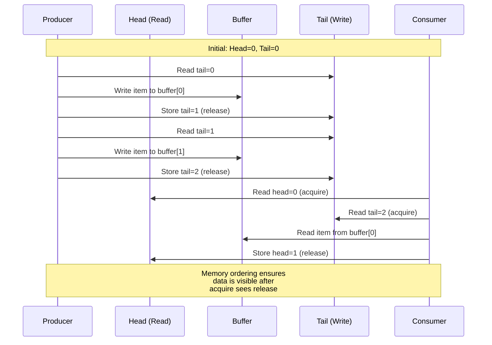
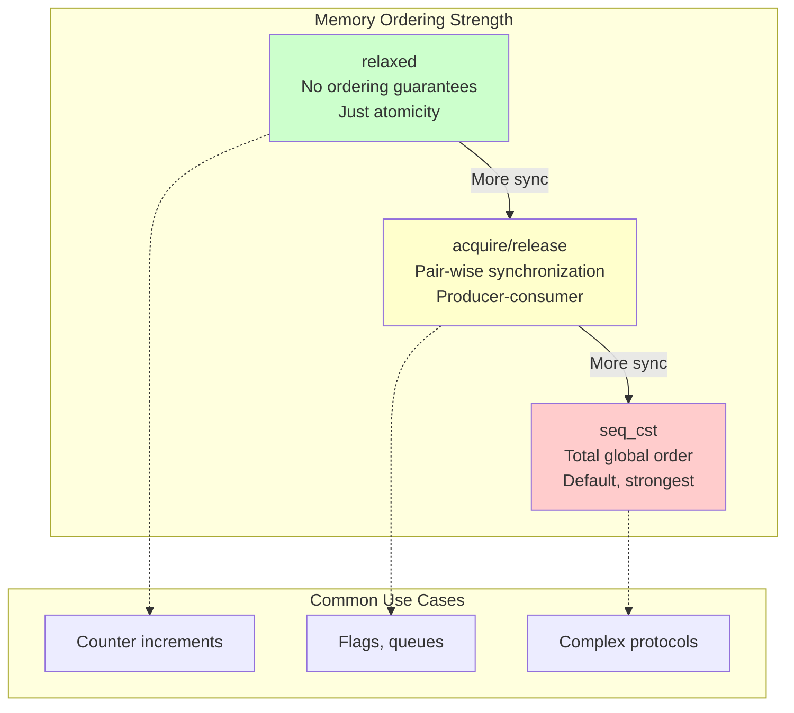
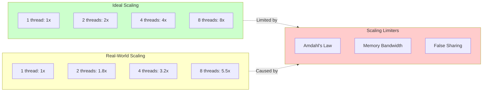

# 05 - Concurrency & Multi-threading

<p align="center">
  
  
  
</p>

> Write efficient multi-threaded code with atomics, lock-free structures, and OpenMP.

Master `std::atomic` memory orderings, build lock-free queues, and parallelize with OpenMP for **linear thread scaling**.

---

## SPSC Queue Operation



---

## Memory Ordering Hierarchy



---

## Thread Scaling Visualization



## Contents

| File | Topic | Key Concept |
|------|-------|-------------|
| `src/atomic_ordering.cpp` | Atomic Operations | Memory ordering |
| `src/lock_free_queue.cpp` | Lock-Free Queue | SPSC queue |
| `src/openmp_basics.cpp` | OpenMP | Simple parallelization |

## Key Concepts

### Atomic Operations & Memory Ordering

`std::atomic` provides thread-safe operations with different memory ordering guarantees:

```cpp
std::atomic<int> counter{0};

// Relaxed: no synchronization, just atomicity
counter.fetch_add(1, std::memory_order_relaxed);

// Acquire-Release: synchronizes with paired operations
flag.store(true, std::memory_order_release);  // Writer
if (flag.load(std::memory_order_acquire)) {}  // Reader

// Sequential Consistency: total order (default, slowest)
counter.fetch_add(1, std::memory_order_seq_cst);
```

**When to use each:**
- `relaxed`: Counters, statistics (no ordering needed)
- `acquire/release`: Producer-consumer patterns
- `seq_cst`: When in doubt, or complex synchronization

### Lock-Free Queue

Single-Producer Single-Consumer (SPSC) queue without locks:

```cpp
template<typename T, size_t Capacity>
class SPSCQueue {
    std::array<T, Capacity> buffer_;
    alignas(64) std::atomic<size_t> head_{0};
    alignas(64) std::atomic<size_t> tail_{0};
    
public:
    bool push(const T& item) {
        size_t tail = tail_.load(std::memory_order_relaxed);
        size_t next = (tail + 1) % Capacity;
        if (next == head_.load(std::memory_order_acquire)) {
            return false;  // Full
        }
        buffer_[tail] = item;
        tail_.store(next, std::memory_order_release);
        return true;
    }
    
    bool pop(T& item) {
        size_t head = head_.load(std::memory_order_relaxed);
        if (head == tail_.load(std::memory_order_acquire)) {
            return false;  // Empty
        }
        item = buffer_[head];
        head_.store((head + 1) % Capacity, std::memory_order_release);
        return true;
    }
};
```

### OpenMP

Simple parallelization with pragmas:

```cpp
#include <omp.h>

// Parallel for loop
#pragma omp parallel for
for (int i = 0; i < n; ++i) {
    process(data[i]);
}

// Reduction
int sum = 0;
#pragma omp parallel for reduction(+:sum)
for (int i = 0; i < n; ++i) {
    sum += data[i];
}

// Set thread count
omp_set_num_threads(4);
```

## Common Pitfalls

### False Sharing

Threads modifying adjacent memory cause cache invalidation:

```cpp
// Bad: counters share cache line
struct Counters {
    int a, b, c, d;  // All on same cache line
};

// Good: pad to cache line
struct Counters {
    alignas(64) int a;
    alignas(64) int b;
    alignas(64) int c;
    alignas(64) int d;
};
```

### Data Races

Use ThreadSanitizer to detect:
```bash
cmake --preset=tsan
cmake --build build/tsan
./build/tsan/your_test
```

## Running Benchmarks

```bash
cmake --preset=release
cmake --build build/release

./build/release/examples/05-concurrency/bench/atomic_bench
./build/release/examples/05-concurrency/bench/lock_free_bench
./build/release/examples/05-concurrency/bench/openmp_bench
```

## Thread Scaling

Test scaling efficiency:
```bash
# Run with different thread counts
OMP_NUM_THREADS=1 ./openmp_bench
OMP_NUM_THREADS=2 ./openmp_bench
OMP_NUM_THREADS=4 ./openmp_bench
OMP_NUM_THREADS=8 ./openmp_bench
```

Ideal scaling: 2 threads = 2x speedup, 4 threads = 4x speedup

Real-world factors limiting scaling:
- Amdahl's Law (serial portions)
- Memory bandwidth
- Cache contention
- False sharing

---

## Expected Results

| Optimization | Speedup | Notes |
|--------------|---------|-------|
| Atomic vs Mutex | 2-5x | Atomics avoid kernel transitions |
| Lock-free vs Mutex Queue | 3-10x | No blocking, cache-friendly |
| OpenMP parallel for | Near-linear | Depends on workload and cores |
| False sharing fix | 5-20x | Critical for shared counters |

---

## Knowledge Check

Test your understanding:

1. **When should you use `memory_order_relaxed`?**
   <details>
   <summary>Click for answer</summary>
   For counters and statistics where you only need atomicity, not ordering. Example: incrementing a global request counter where exact ordering doesn't matter.
   </details>

2. **Why is `alignas(64)` used in the SPSC queue?**
   <details>
   <summary>Click for answer</summary>
   To place head and tail on separate cache lines, preventing false sharing. Without this, producer and consumer threads would contend for the same cache line even though they access different variables.
   </details>

3. **What's the difference between `parallel for` and `parallel for reduction`?**
   <details>
   <summary>Click for answer</summary>
   `parallel for` divides iterations among threads with no coordination. `reduction` handles variables that accumulate values (like sum), creating thread-local copies and combining them at the end.
   </details>

---

## Further Reading

- [C++ Concurrency in Action](https://www.manning.com/books/c-plus-plus-concurrency-in-action)
- [Memory Barriers: a Hardware View for Software Hackers](http://www.rdrop.com/users/paulmck/scalability/paper/whymb.2010.07.23a.pdf)

---

## Next Steps

- Review the [Optimization Decision Tree](../../docs/en/guides/optimization-decision-tree.md) for systematic optimization
- Practice with [Concurrency Exercises](../../docs/en/exercises/module-05-concurrency.md)
- Read the [Profiling Guide](../../docs/en/guides/profiling-guide.md) to analyze multi-threaded performance
