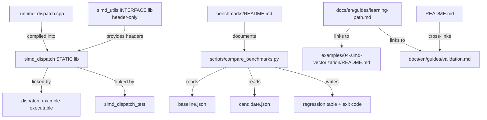

# Design: Performance Teaching Hardening

## Overview

This change closes four teaching gaps on existing surfaces without introducing new modules. All work is bounded to `examples/04-simd-vectorization/`, `scripts/`, `docs/`, and module README files.

## Architecture overview

## Design decisions

### 1. SIMD runtime dispatch

**Goal**: Show readers how to select the fastest available instruction path at runtime rather than at compile time.

**Approach**: Add `examples/04-simd-vectorization/src/runtime_dispatch.cpp` with a `dispatch_add_arrays` function that uses `cpuid` (via `__builtin_cpu_supports` on GCC/Clang) to select AVX2, SSE2, or scalar at runtime. The function is compiled into a new **`STATIC` library target `simd_dispatch`** (not the existing `simd_utils` INTERFACE target) that links `simd_utils` for headers. The example executable and the corresponding test both link `simd_dispatch`. `simd_utils` remains header-only.

**Rationale**: `__builtin_cpu_supports` is available on GCC ≥ 4.8 and Clang ≥ 3.7, covers the C++17 baseline, and avoids a platform-specific CPUID wrapper. The function name stays within the `hpc::simd` namespace. A companion `tests/` entry validates correctness against the scalar reference.

**Compiler guard**: `__builtin_cpu_supports` is a GCC/Clang extension. The implementation must wrap dispatch logic in `#if defined(__GNUC__) || defined(__clang__)`. On any other compiler (e.g., MSVC) the code falls through to the scalar path unconditionally. MSVC-specific CPUID dispatch is explicitly out of scope for this change.

**Trade-off**: Does not use `ifunc` or a separate DSO; runtime dispatch is done once via a function pointer set at call site. This is simpler and sufficient for a teaching example.

### 2. Vectorization diagnostics workflow

**Goal**: Make compiler vectorization reports reachable without reading CMakeLists.txt.

**Approach**: Add a "Vectorization Diagnostics" section to `examples/04-simd-vectorization/README.md` that shows the exact build commands (`cmake --preset=debug -DCMAKE_CXX_FLAGS="-fopt-info-vec-optimized"` / `-Rpass=loop-vectorize`) and how to read the output. Mirror a condensed version in `docs/` under the SIMD learning path entry.

**Flag note**: Use `-fopt-info-vec-optimized` (not the broader `-fopt-info-vec`) for GCC because it reports only successfully vectorized loops, which is more useful for teaching. The existing `docs/en/guides/learning-path.md` already uses `-fopt-info-vec-optimized`; this change must stay consistent with that.

**Trade-off**: We do not add a new CMake preset for this; a reader-visible flag override is sufficient and avoids preset sprawl.

### 3. Sanitizer workflow in reader-facing docs

**Goal**: A reader can find and run ASan/TSan/UBSan without knowing the preset names in advance.

**Approach**: Add `docs/en/guides/validation.md` as a new VitePress page in the docs site. Reference the three preset names (`asan`, `tsan`, `ubsan`) with copy-pasteable commands. Cross-link from the repository README quick-start.

**Trade-off**: Keep this as documentation only. Do not add a new composite preset or script; the existing presets are complete.

### 4. Benchmark regression comparison

**Goal**: A maintainer can compare two benchmark JSON runs and see which benchmarks regressed.

**Approach**: Add `scripts/compare_benchmarks.py` (Python 3, stdlib only — no third-party packages) that accepts two JSON files (baseline and candidate) and prints a table of benchmark name, baseline ns/iter, candidate ns/iter, and delta %. Exit code 1 if any benchmark regresses by more than a configurable threshold (default 10%). Add a "Regression Comparison" section to `benchmarks/README.md` showing the capture-and-compare workflow.

**Rationale**: stdlib-only ensures the script works without a virtualenv. The threshold flag makes it usable in CI without hardcoding expected values.

**Trade-off**: Does not publish results to a dashboard (out of scope). Does not integrate into GitHub Actions in this change (would be a follow-on if needed).

## File surface

| Path | Change |
|------|--------|
| `examples/04-simd-vectorization/src/runtime_dispatch.cpp` | New: runtime CPU dispatch implementation |
| `examples/04-simd-vectorization/src/dispatch_example_main.cpp` | New: `dispatch_example` executable entry point |
| `examples/04-simd-vectorization/CMakeLists.txt` | Extend: add `simd_dispatch` STATIC library target and `dispatch_example` executable target |
| `tests/unit/simd/simd_dispatch_test.cpp` | New: correctness test for `dispatch_add_arrays` |
| `examples/04-simd-vectorization/README.md` | Extend: vectorization diagnostics section |
| `docs/en/guides/learning-path.md` | Extend: vectorization diagnostics, sanitizer cross-link |
| `docs/en/guides/validation.md` | New: sanitizer preset workflow (asan/tsan/ubsan) |
| `README.md` | Extend: cross-link to sanitizer docs |
| `scripts/compare_benchmarks.py` | New: benchmark regression comparison script |
| `benchmarks/README.md` | New: capture-and-compare workflow section |
